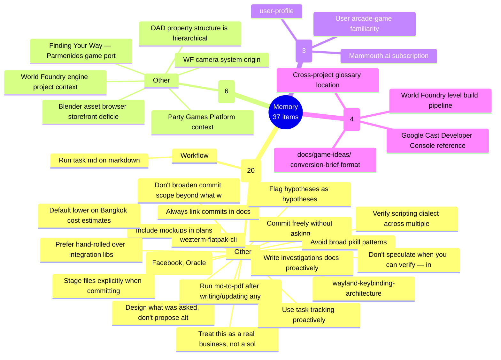
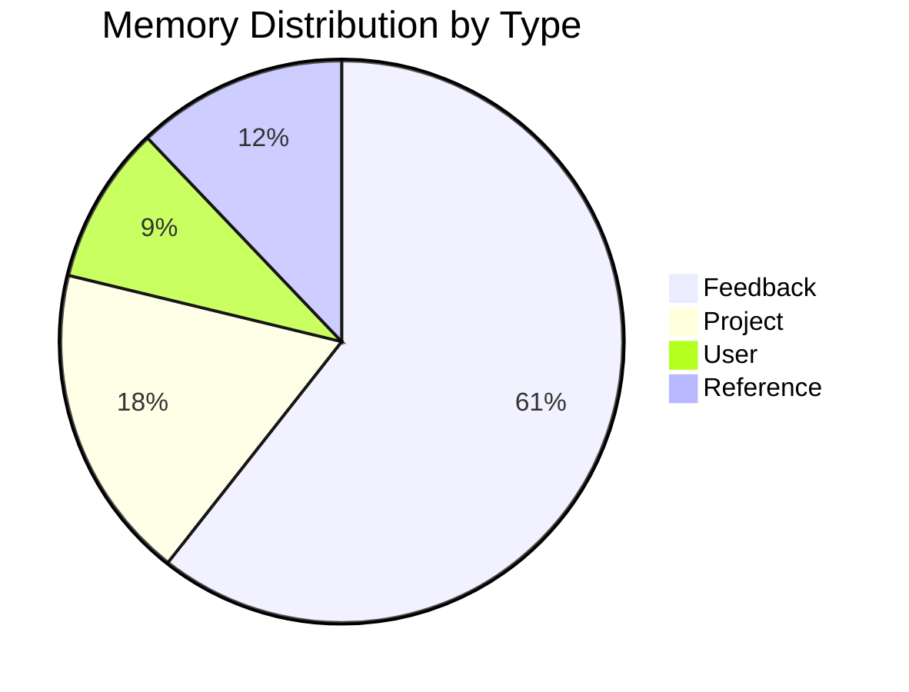
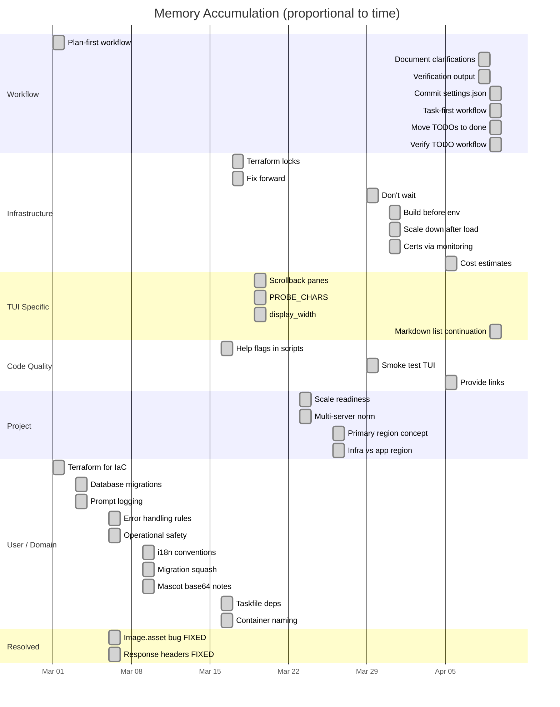
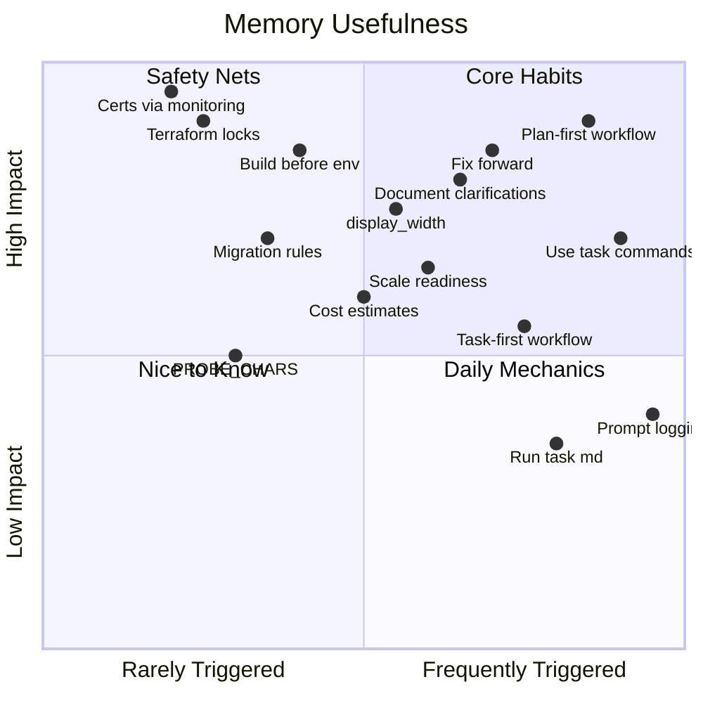
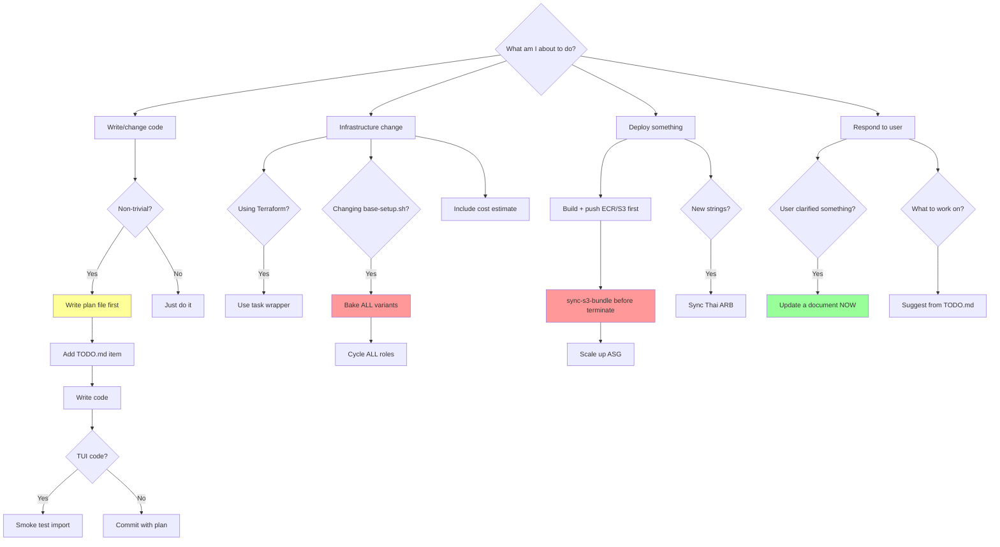
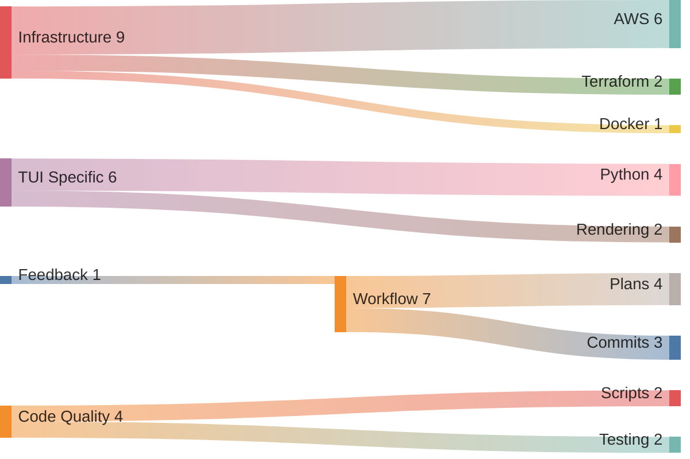
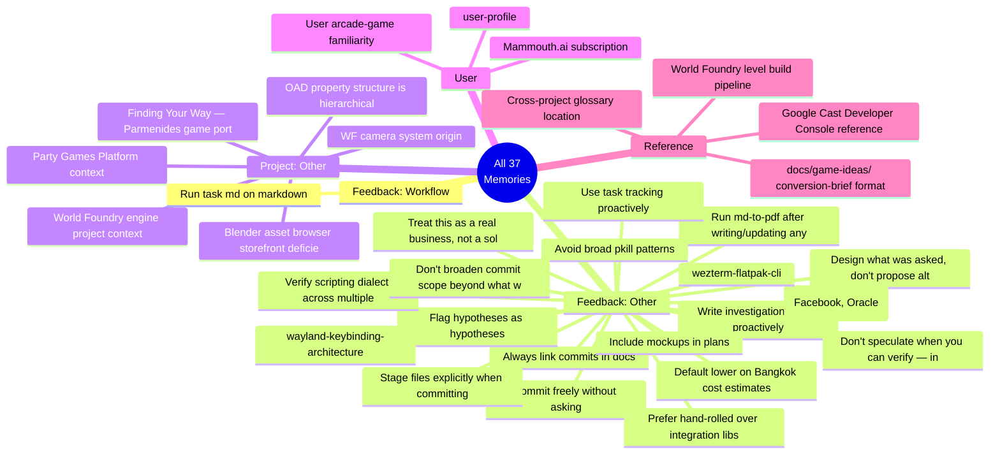

# Memory Visualizations

37 memories across 5 types, generated 2026-05-19 23:59.

---

## 1. Mindmap — Full Memory Landscape



## 2. Treemap — Category Proportions

```
+--------------------------------------------------------------------+
|                                                                    |
|                     FEEDBACK (20 items — 54%)                      |
|                                                                    |
|  +-----------------------------+  +-----------------------------+  |
|  |         Workflow (1)        |  |          Other (19)         |  |
|  |                             |  |                             |  |
|  | Run task md on markdown     |  | Treat this as a real bus... |  |
|  +-----------------------------+  | Commit freely without as... |  |
|                                   | Always link commits in docs |  |
|                                   | Design what was asked, d... |  |
|                                   | Stage files explicitly w... |  |
|                                   | ...+14 more                 |  |
|                                   +-----------------------------+  |
+--------------------------------------------------------------------+
+--------------------+  +--------------------+  +--------------------+
|  PROJECT (6/16%)   |  |    USER (3/8%)     |  | REFERENCE (4/11%)  |
+--------------------+  +--------------------+  +--------------------+
```

## 3. Pie Chart — Distribution by Type



## 4. Timeline — When Memories Were Learned



## 5. Quadrant Chart — Memory Impact vs Frequency



## 6. Flowchart — Decision Tree for Common Situations



## 7. Sankey — How Memories Connect to Project Areas



## 8. Block Diagram — Memory by Concern Layer

```
                        +---------------------------------+
                        |          USER INTENT            |
                        |  plan-first | prompt logging    |
                        |  suggest TODO | document clarify|
                        +---------------------------------+
                                      |
                        +---------------------------------+
                        |         CODE QUALITY            |
                        |  refactoring ok | help flags    |
                        |  smoke test | display_width     |
                        |  task-first | commit settings   |
                        +---------------------------------+
                                      |
              +-------------------+---+---+-------------------+
              |                   |       |                   |
    +---------+--------+ +-------+-----+ +---------+---------+
    |     FRONTEND     | |   BACKEND   | |        TUI        |
    |                  | |             | |                   |
    | i18n (Thai sync) | | migrations  | | PROBE_CHARS       |
    | AssetManifest    | | error logs  | | scrollback        |
    | container naming | | MetricsCol  | | unicode boxes     |
    +------------------+ +-------------+ | mermaid <br/>     |
                                         +-------------------+
                                      |
                        +---------------------------------+
                        |        INFRASTRUCTURE           |
                        |  terraform only | task wrappers |
                        |  fix forward | bake ALL variants|
                        |  build before scale | tf locks  |
                        |  no LE on instances | costs     |
                        +---------------------------------+
                                      |
                        +---------------------------------+
                        |          OPERATIONS             |
                        |  sync-s3 before terminate       |
                        |  scale down after load tests    |
                        |  don't wait — monitor + report  |
                        |  certs via monitoring server    |
                        +---------------------------------+
```

## 9. Complete Memory Listing



## 10. Full Memory Contents

<table>
<tr><th>#</th><th>File</th><th>Name</th><th>Type</th><th>Project</th></tr>

<tr style="background:#f0f0f0"><td>1</td><td><code>feedback_business_ops.md</code></td><td>Treat this as a real business, not a solo hobby</td><td>feedback</td><td><i style="color:#888">general</i></td></tr>
<tr><td colspan="5">Don't reason from "you're a solo operator on a personal account, the
difference doesn't really matter" when making operational/security choices.
The user is building a business. The patterns, credentials, and
infrastructure set up *now* are what a second operator or a future employee
or the user-in-three-years will inherit.<br/><br/>

<b>Why:</b> user explicitly called this out after I handwaved Account vs User
API Tokens as "fine either way for a one-person account." Correct framing is
"use the pattern that survives user turnover and looks right when someone
else reads it," not "pick whichever is faster to click."<br/><br/>

<b>How to apply:</b> default to the option with proper operational hygiene:
- Account-scoped API tokens over user-scoped, where Cloudflare offers both.
- Narrow token scopes; delete/roll after use.
- Clear naming so a future operator can audit what each token does.
- Scripts as the primary interface; dashboard clicks are the escape hatch,
  not the default.
- Document the "why" in script headers so the setup can be re-derived.<br/><br/>

When in doubt, ask what the right operational standard is — don't
pre-dismiss it as overkill for a one-person setup.</td></tr>

<tr><td>2</td><td><code>feedback_commit_freely.md</code></td><td>Commit freely without asking</td><td>feedback</td><td><i style="color:#888">general</i></td></tr>
<tr><td colspan="5">Commit whenever a logical chunk of work is done — don't ask first.<br/><br/>

<b>Why:</b> Git commits are free. Rewrites not in git are much harder to recover from. User explicitly prefers frequent, granular commits.<br/><br/>

<b>How to apply:</b> After any self-contained change (investigation doc written, TODO updated, plan moved, feature landed), just commit. Never ask "should I commit this?"</td></tr>

<tr style="background:#f0f0f0"><td>3</td><td><code>feedback_commit_links.md</code></td><td>Always link commits in docs</td><td>feedback</td><td><i style="color:#888">general</i></td></tr>
<tr><td colspan="5">When a doc references a commit by hash, always include the full GitHub link.<br/><br/>

<b>Why:</b> User always wants clickable links to referenced commits; bare hashes require manual lookup.<br/><br/>

<b>How to apply:</b> Format as <code>[short description](https://github.com/wbniv/WorldFoundry/commit/<hash>)</code> whenever a commit hash appears in any <code>.md</code> file.</td></tr>

<tr><td>4</td><td><code>feedback_design_scope.md</code></td><td>Design what was asked, don't propose alternatives</td><td>feedback</td><td><i style="color:#888">general</i></td></tr>
<tr><td colspan="5">When the user asks how to integrate / build / wire-up a specific thing, design *that thing*. Do not introduce an architectural alternative they didn't request and then editorialise about which to pick.<br/><br/>

<b>Why:</b> During the Asteroids/Cast viewport investigation, user asked specifically "how could we incorporate a Chromecast to address the viewport issue for Space Duel" — i.e., add Cast/phones to the WF-native build. I responded with a "Path A vs. Path B" framing, recommended building a separate all-web Asteroids on <code>party-games-platform</code> instead, and added a "don't try to merge them" lecture. User pushed back: *"i wasn't trying to merge them at all. just looking to see how we could incorporate a chromecast to address the viewport issues for space duel. fix the plan."* The strategic alternative was unwelcome because it answered a question they hadn't asked.<br/><br/>

<b>How to apply:</b> When a user asks an integration / how-to question with a clear scope, treat the scope as fixed. Design within it. If a genuinely better path exists, mention it in *one or two sentences* as a follow-up note ("If you ever wanted X instead, that'd look like Y") — not as the headline of the response, not as a recommendation, not as a "the two are different products" framing. Default: trust that the user has thought about scope and is asking what they're asking.</td></tr>

<tr style="background:#f0f0f0"><td>5</td><td><code>feedback_git_commit_am.md</code></td><td>Stage files explicitly when committing</td><td>feedback</td><td><i style="color:#888">general</i></td></tr>
<tr><td colspan="5">Don't use <code>git commit -am</code> in this repo. The working tree has long-standing pre-existing changes under <code>wfsource/</code> and <code>wflevels/</code> (deletions and untracked dirs that have been there since session start) that are NOT ours to ship. <code>-a</code> stages every tracked modification including those deletions. Happened twice today; had to <code>git reset HEAD~1 --soft</code> + unstage + recommit both times.<br/><br/>

<b>Why:</b> The repo is a working copy where the user has in-progress work across many areas. Our touches are confined to <code>party-games/</code> and <code>docs/plans/</code>, and commits need to stay that scoped — sweeping up unrelated deletions makes commits misleading and risks destroying work if ever force-pushed.<br/><br/>

<b>How to apply:</b> <code>git add <specific paths></code> then <code>git commit -m …</code> — never <code>commit -a</code> or <code>commit -am</code>. For the Party Games project specifically, the scope is <code>party-games/<b></code> and <code>docs/plans/</b></code>.</td></tr>

<tr><td>6</td><td><code>feedback_investigations.md</code></td><td>Write investigations docs proactively</td><td>feedback</td><td><i style="color:#888">general</i></td></tr>
<tr><td colspan="5">Write to <code>docs/investigations/</code> whenever research produces findings worth preserving — protocol analysis, architecture audits, compatibility notes, etc. Don't ask first.<br/><br/>

<b>Why:</b> User had to prompt explicitly for the Godot protocol investigation doc after I added only a paragraph to the plan. "You don't need to ask permission to save things you think are noteworthy to docs/investigations/."<br/><br/>

<b>How to apply:</b> When an agent or research task returns substantial findings, write the investigation doc immediately and commit it. Keep plan docs focused on decisions; put the supporting evidence in investigations/.</td></tr>

<tr style="background:#f0f0f0"><td>7</td><td><code>feedback_md_to_pdf_after_writes.md</code></td><td>Run md-to-pdf after writing/updating any .md file</td><td>feedback</td><td>WorldFoundry-wbniv</td></tr>
<tr><td colspan="5">After writing or updating any <code>.md</code> file in <code>/home/will/SRC/WorldFoundry-wbniv</code>, run <code>task md -- <path1> [<path2> ...]</code> (which calls <code>../python-tui-lib/scripts/md-to-pdf.sh</code>) without being asked. Multiple files in one invocation is fine and preferred.<br/><br/>

<b>Why:</b> User expectation; they want to see the rendered output without having to ask each time. Confirmed 2026-04-28 after the user explicitly reminded me ("you're supposed to do this every time you write/update an .md file").<br/><br/>

<b>How to apply:</b>
- Triggers on any <code>Write</code> or <code>Edit</code> to <code>*.md</code> files inside this repo (docs/, etc.). Includes the README updates.
- Batch multiple files into a single <code>task md --</code> invocation when several were written in the same session.
- The Taskfile resolves bare names by searching under <code>docs/</code>, so <code>task md -- omega-race.md</code> works as well as the full path.
- Output lands in <code>/home/will/tmp/*.html</code> and auto-opens in the existing browser.
- Skip only if the user has explicitly said "don't render" or the edit is trivial (e.g. fixing a typo I just made in the same turn before the first render).
- This applies to MEMORY.md and feedback memory files too — they're <code>.md</code> — but in practice rendering memory files has no value, so use judgment: only render content the user is going to *read* (docs, briefs, investigations).</td></tr>

<tr><td>8</td><td><code>feedback_mockups.md</code></td><td>Include mockups in plans</td><td>feedback</td><td><i style="color:#888">general</i></td></tr>
<tr><td colspan="5">Always include ASCII mockups for any UI panels, operators, or dialogs described in a plan document. Don't wait to be asked.<br/><br/>

<b>Why:</b> User has asked for mockups explicitly after the fact on multiple plans ("why do i always have to ask for these explicitly?"). They help reviewers understand the design before implementation.<br/><br/>

<b>How to apply:</b> Whenever a plan describes a Blender panel, dialog, HUD, or any visible UI, add an ASCII art mockup immediately after the description, before the implementation notes.</td></tr>

<tr style="background:#f0f0f0"><td>9</td><td><code>feedback_overclaim.md</code></td><td>Flag hypotheses as hypotheses</td><td>feedback</td><td><i style="color:#888">general</i></td></tr>
<tr><td colspan="5">When I don't actually know, say so. Two specific instances today:<br/><br/>

1. I wrote "This is the single most common gotcha for Cast test devices" about the empty Sender Details theory. User (correctly) called that out as presenting speculation as established knowledge. I amended with "I overstated, I don't actually know".
2. I wrote in the session plan that setting a static IPv4 on the TV fixed YouTube casting, implying cause-and-effect. User pushed back: they're not sure what actually fixed it; the static-IP timing coincided with other variables.<br/><br/>

<b>Why:</b> User has been doing this a long time and can tell when I'm reasoning from thin data vs. recalling documented behavior. Confident-sounding speculation erodes trust faster than honest uncertainty does. They'd rather know "here's my best guess and the reasoning" than "here's THE answer" when the latter isn't actually backed up.<br/><br/>

<b>How to apply:</b> When writing explanations (especially in plan docs, commit messages, and UI-facing strings), watch for words like "always", "the reason", "the most common" — if I haven't actually verified the claim, hedge it ("I think", "this is consistent with", "we haven't isolated whether"). When committing a fix, describe what the change does and what symptom it addressed; don't claim it's the root cause unless we actually proved it was.</td></tr>

<tr><td>10</td><td><code>feedback_process_kill.md</code></td><td>Avoid broad pkill patterns</td><td>feedback</td><td><i style="color:#888">general</i></td></tr>
<tr><td colspan="5">Don't use broad <code>pgrep -af … | xargs kill</code> or <code>pkill -f "node.*index.js"</code> to clean up before restarting a dev server — the user often has their own copy running from a terminal, and the broad pattern kills it too. Today this happened multiple times; the user only noticed hours later ("i don't know when this happened" with a SIGTERM shutdown log).<br/><br/>

<b>Why:</b> The user manages their own dev server in a terminal and reasonably assumes I won't touch it. Killing it silently breaks their flow and they don't know why until they look.<br/><br/>

<b>How to apply:</b> Prefer killing by the specific PID returned from <code>run_in_background</code> (I know that PID). If I don't know the exact PID and do need to clear port 8080, check <code>pgrep -af "node.*index.js"</code> first and ask before killing anything that isn't mine. Better still: let the user restart their own server — I can just tell them the change is live once the static files are rewritten.</td></tr>

<tr style="background:#f0f0f0"><td>11</td><td><code>feedback_verify_scripting_dialect.md</code></td><td>Verify scripting dialect across multiple files before claiming canonical</td><td>feedback</td><td><i style="color:#888">general</i></td></tr>
<tr><td colspan="5">When working on a project that's mid-migration between scripting dialects (e.g. WF moving from Scheme <code>.s</code> to zForth), don't take any one example file as canonical. The user has corrected this twice in one conversation:<br/><br/>

1. I pushed Fennel based on one Plan agent's report; user asked "why are you interested in fennel" — the answer was just that Fennel was the freshest sigil I'd seen. Should have checked existing examples first.
2. I claimed "every working game script in wflevels/ is Lisp/Scheme dialect" based on <code>cart.s</code> / <code>fury1.s</code> / <code>shell.s</code>. User corrected: snowgoons and the shell HAVE been converted to Forth. Forth versions live in <code>.aib</code> files, <code>.fth</code> files, and embedded inside <code>.lev</code> Script fields — not just in <code>.s</code> files.<br/><br/>

<b>Why:</b> mid-migration codebases have multiple coexisting dialects; pre-conversion samples remain on disk. Picking the wrong "canonical" sets the wrong default for new code and earns a correction.<br/><br/>

<b>How to apply:</b> before stating "the language is X" in a plan or doc, grep for evidence in *all* relevant file types. For WF specifically:
- <code>find wflevels -name "*.s" -o -name "*.aib" -o -name "*.fth"</code> — Forth-converted scripts often have different extensions
- <code>grep -rln '\\\\ wf' wflevels/</code> — Forth scripts embedded in <code>.lev</code> files use <code>\ wf</code> sigil
- <code>find wfsource -name "*.fth"</code> — engine-side Forth code (e.g. <code>shell.fth</code>) signals the canonical direction
- <code>find scripts -name "*forth*"</code> — migration scripts indicate the conversion target</td></tr>

<tr><td>12</td><td><code>project_camera_system.md</code></td><td>WF camera system origin</td><td>project</td><td><i style="color:#888">general</i></td></tr>
<tr><td colspan="5">The World Foundry camera system is unusually powerful/flexible. It got that way organically — the designer kept changing what game he was making, so the camera had to accommodate many different modes/styles to keep up.<br/><br/>

<b>Why:</b> Accidental over-engineering from scope churn, not intentional design.
<b>How to apply:</b> When the camera system seems surprisingly capable or complex for the context, that's why. Frame it as a feature, not over-engineering.</td></tr>

<tr style="background:#f0f0f0"><td>13</td><td><code>project_oad_structure.md</code></td><td>OAD property structure is hierarchical</td><td>project</td><td><i style="color:#888">general</i></td></tr>
<tr><td colspan="5">OAD schemas use <code>LEVELCONFLAGCOMMONBLOCK(name)</code> and <code>PROPERTY_SHEET_HEADER(...)</code> to define named sub-structs. Both bare field names (<code>Speed</code>) and scoped paths (<code>common.Speed</code>, <code>movebloc.maxVelocity</code>) are technically accurate, but scoped is preferred — unambiguous, readable, and consistent with Godot's dot-path convention. Flat is not preferred.<br/><br/>

<b>Why:</b> Sub-block structure is real and legible; scoped paths make block membership explicit in the wire format.<br/><br/>

<b>How to apply:</b> Use <code>"key": "common.Speed"</code> style in <code>scene:set_prop</code> (Phase 2b). Aligns with Godot's property path convention.</td></tr>

<tr><td>14</td><td><code>project_party_games.md</code></td><td>Party Games Platform context</td><td>project</td><td>bumper2bumper</td></tr>
<tr><td colspan="5">Party Games Platform lives at <code>party-games/</code> on branch <code>party-games-platform</code> (off the older <code>2026-ios</code> HEAD). Node.js relay + receiver shell (TV) + controller shell (phone). <b>Three games as plugins</b> after Phase 5: <code>games/reaction/</code>, <code>games/image/</code>, <code>games/worst-take-wins/</code> (fill-in-the-blank card game, CAH model). Each game ships server-side state machine + <code>client/</code> module (controller.js + receiver.js + CSS) loaded dynamically by the shell.<br/><br/>

Parent plan: <code>docs/plans/2026-04-22-party-games-platform-phase-1.md</code> (has a Phase 5 completion summary appended at the bottom as of 2026-04-23). Phase 5 plan file: <code>/home/will/.claude/plans/phase-5-atomic-pine.md</code>.<br/><br/>

<b>Phase 5 (2026-04-23) — landed.</b> Per-game client-asset plugin seam + retrofit of reaction/image onto it + Worst Take Wins as the third game. Key architectural change: <code>createServer</code> now takes <code>gameName</code> + <code>gamesRoot</code>; shell HTML has <code>{{GAME_NAME}}</code> + <code>{{GAME_STYLESHEET}}</code> placeholders substituted per request; <code>/game/client/*</code>, <code>/game/assets/*</code>, <code>/shell-lib/*</code> routes route to per-game and shared assets respectively (each with its own path-traversal guard). Game client modules export <code>mount(ctx)</code> / <code>unmount()</code>; ctx = <code>{ root, send, on, playerId, isHost, players, hostId, feedback, assetUrl, log }</code>. Shell JS is ES-module now, loads the game module via dynamic import on WELCOME.<br/><br/>

Test count: <b>98</b> across four locations (reaction 15, image 22, worst-take-wins 30, platform/server 31). All green.<br/><br/>

<b>Phase 1d (physical Chromecast verification) — still blocked.</b> Awaiting Google Cast Console propagation of the recreated app (<code>071CDEDD</code>); their docs say up to 48 h, no UI indicator for completion. Detection: reload the controller URL, <code>cast-state</code> flips from <code>cast: no devices found</code> → <code>cast: ready — tap the button</code> when it's through. Phase 5 work did not touch Cast integration — Phase 1d verification remains the next gating step whenever propagation completes.<br/><br/>

<b>Why Phase 5 was bundled with the platform refactor:</b> original scope was "scaffold cards plugin" but exploration showed <code>createServer({ game })</code> generalised on the server side while the shells had reaction+image assumptions hardcoded. A third game meant either a third set of hardcoded cases or a real per-game client seam; user picked the largest-scope option (seam refactor + retrofit reaction/image + new game + CAH deck wired in).<br/><br/>

<b>How to apply:</b> When user returns to Phase 1d, check the Cast picker first; only debug if propagation genuinely is done. Launch commands: <code>cd party-games/platform/server && WF_GAME=worst-take-wins node index.js</code> (or reaction / image / none).<br/><br/>

<b>Stable public URL (as of 2026-04-24):</b> <code>https://pg.rapid-raccoon.com</code> — named Cloudflare Tunnel <code>party-games</code> on this laptop → <code>localhost:8080</code>. Replaces the old rotating trycloudflare.com quick tunnels. Cast Console receiver URL is now <code>https://pg.rapid-raccoon.com/receiver</code> (set 2026-04-24). Don't cycle the Cast Console URL any more — stable now, no more restarting the propagation clock. Setup script: <code>~/SRC/bumper2bumper/scripts/cloudflare-create-named-tunnel.sh</code>. Config at <code>~/.cloudflared/config.yml</code>; tunnel runs by hand (<code>cloudflared tunnel run party-games</code>) until Party Games relay moves to an AWS server (TODO in migration plan).<br/><br/>

<b>Explicit castAppId while propagation is pending:</b> during the propagation window, always include <code>&castAppId=071CDEDD</code> on controller test URLs — the explicit param is the only reliable path on-device, not the hardcoded default in <code>controller.js:22</code>. URL form: <code>https://pg.rapid-raccoon.com/controller?name=<n>&castAppId=071CDEDD</code>. Drop this once Phase 1d hardware acceptance passes. And: do not volunteer laptop-Linux-Chrome-Cast-discovery debugging as a first move — the real constraint is the Cast Console propagation clock, not desktop discovery flakiness.<br/><br/>

<b>Still owed after Phase 5:</b> live in-browser click-through with 3 controllers + 1 receiver for WTW. Server-side is covered by unit + integration tests; client DOM rendering is only syntax-verified. User should play one round end-to-end in browser to confirm.<br/><br/>

Two physical Chromecast-with-Google-TV devices, both whitelisted: <code>31191HFGN54Q67</code> ("th", currently plugged in) and <code>2628105GN0GT7C</code> ("ch", spare). Google Home labels them "TV" — that's what the sender picker shows, not the Cast Console description.<br/><br/>

Cast dev account: wbnorris@gmail.com.</td></tr>

<tr style="background:#f0f0f0"><td>15</td><td><code>project_storefront_deficiencies.md</code></td><td>Blender asset browser storefront deficiencies</td><td>project</td><td><i style="color:#888">general</i></td></tr>
<tr><td colspan="5">These were identified while adding Sketchfab/commercial-provider support to <code>wftools/wf_blender/asset_browser.py</code> (2026-04-29). The user wants to build an improved storefront later; these are the gaps to solve.<br/><br/>

1. <b>Linear-only layout</b> — Blender UIList is a fixed scrollable list; no masonry/grid, no resizable thumbnails. A web storefront could show 4–6 assets per row.
2. <b>No in-viewport 3D preview</b> — can't orbit/inspect a model before importing. A storefront could embed a Sketchfab viewer iframe.
3. <b>No purchase / OAuth flow</b> — paid assets require leaving Blender. A storefront could embed payment or a purchase-confirmation webhook.
4. <b>No wishlist or cart</b> — sessions are stateless; panel forgets results when closed. A storefront would persist a wishlist.
5. <b>Single-select only</b> — can't compare two candidates side-by-side or batch-import.
6. <b>No cross-provider price comparison</b> — TurboSquid vs. Sketchfab prices not visible in same view.
7. <b>API key in Blender prefs</b> — stored plaintext in Blender prefs JSON; not OS keychain.
8. <b>Attribution workflow is manual</b> — <code>attribution_string</code> in manifest.json but no "Export credits.txt" button.
9. <b>No semantic / similarity search</b> — keyword only; a storefront could embed vector search.
10. <b>No browse history or favorites</b> — panel forgets state between sessions.
11. <b>Licence provenance chain invisible</b> — <code>derived_from</code> in manifest.json has no UI; a storefront could render the remix DAG.
12. <b>Thumbnail fidelity</b> — Blender icon preview is effectively 128×128; a storefront can show 512px+.
13. <b>Audio out of scope entirely</b> — master/sync/mechanical rights can't be modelled in the policy TOML; a storefront could handle per-asset-type licensing.<br/><br/>

<b>Why:</b> User explicitly noted these while building v2 of the asset browser, intending to use them as requirements for a future purpose-built storefront.
<b>How to apply:</b> When user asks about "storefront" or "improved asset browser" in this project, refer to this list as the starting requirements.</td></tr>

<tr><td>16</td><td><code>project_world_foundry.md</code></td><td>World Foundry engine project context</td><td>project</td><td><i style="color:#888">general</i></td></tr>
<tr><td colspan="5">World Foundry is a late-1990s 3D game engine being actively modernized in 2026 (legacy GL → modern OpenGL 3.3+ GLSL, custom physics → Jolt, single-script → router-dispatched scripting with Lua/zForth/Fennel/QuickJS/WAMR).<br/><br/>

<b>Scripting language conversion is in flight.</b> The legacy <code>.s</code> files (<code>wflevels/cart.s</code>, <code>fury1.s</code>, <code>dumbfury.s</code>, <code>xyzrotate.s</code>, <code>shell.s</code>) are Lisp/Scheme dialect — pre-conversion samples. The post-conversion canonical path is <b>zForth</b> (sigil <code>\ wf</code>):
- Snowgoons (<code>wflevels/snowgoons-blender/snowgoons.lev</code>) embeds Forth Script blocks (e.g. <code>INDEXOF_HARDWARE_JOYSTICK1_RAW read-mailbox INDEXOF_INPUT write-mailbox</code>).
- Engine shell is <code>wfsource/source/game/shell.fth</code>.
- Level shell is <code>wflevels/shell.aib</code> (Forth) — <code>wflevels/shell.s</code> is the legacy Scheme version still on disk.
- <code>scripts/patch_shell_forth.py</code> exists to migrate.
- zForth plug at <code>engine/stubs/scripting_zforth.cc</code> ships <code>read-mailbox</code> / <code>write-mailbox</code> bridge words and pre-loads all <code>mailbox.def</code> symbols as zForth <code>constant</code>s.
- Bubba / Minecart / Babylon5 still ship Scheme <code>.s</code> files; conversion not yet complete.<br/><br/>

<b>Current branch/work focus:</b> <code>party-games-platform</code> is a parallel branch for a different effort (cast-based couch party game, see <code>project_party_games.md</code>). The engine modernization happens elsewhere; new game work is on its own feature branch.<br/><br/>

<b>Room graph — what it actually is:</b> "Rooms" are not literal rooms; they are named zones that partition the world. The mechanism was designed to manage <b>CD asset streaming</b> — as the player moves through a level, assets (geometry, textures, scripts, audio) are loaded and unloaded zone-by-zone against a streaming budget. The room/zone graph is the designer-controlled handle on that streaming. Camera rigs and actor scoping attach per-zone as a consequence of authoring, not as the primary purpose.<br/><br/>

<b>Why this matters for me:</b> Don't take any single example as canonical. Always check multiple files (<code>.s</code>, <code>.aib</code>, <code>.fth</code>, <code>.lev</code>-embedded) before claiming "this is how WF scripts are written."<br/><br/>

<b>No established Forth-script conventions yet.</b> Snowgoons has two one-liners; the engine shell has <code>shell.fth</code>. That's the entire corpus. When writing new Forth game scripts, design the style fresh; don't hallucinate prevailing patterns. Reasonable defaults: kebab-case word names, predicate words ending in <code>?</code>, ANS Forth <code>if/else/then</code> (zForth supports both <code>fi</code> and <code>then</code>; snowgoons uses <code>then</code>), <code>MB_*</code> prefix for user-defined mailbox slots, <code>SFX_*</code> prefix for sound IDs.<br/><br/>

<b>zForth gotchas (verified in <code>engine/stubs/scripting_zforth.cc</code> and <code>engine/vendor/zforth-41db72d1/src/zforth/zforth.c</code>):</b>
- <b><code>constant</code> is broken at runtime</b> in the embedding model (see comment block at scripting_zforth.cc:244). Use <code>: NAME VALUE ;</code> instead — that's how <code>AddConstantArray</code> registers <code>INDEXOF_*</code> constants too.
- <b><code>negate</code> and <code>abs</code> aren't defined.</b> kCoreBootstrap stops at <code><</code>, <code>></code>, <code><=</code>, <code>>=</code>, <code><></code>, <code>0<></code>, <code>not</code>, <code>over</code>, <code>1+</code>, <code>1-</code>. Define negate/abs yourself: <code>: negate 0.0 swap - ; : abs dup 0 < if negate then ;</code>.
- <b>Mailbox names ship as <code>INDEXOF_<NAME></code></b> (e.g. <code>INDEXOF_HARDWARE_JOYSTICK1_RAW</code>, <code>INDEXOF_X_POS</code>), not the bare names from <code>mailbox.def</code>. Bridge words: <code>read-mailbox ( idx -- val )</code>, <code>write-mailbox ( val idx -- )</code>.
- <b>Cross-actor mailbox reads aren't exposed yet.</b> Single-arg <code>read-mailbox</code> only operates on the current actor (<code>g_curObj</code>). Lua plug exposes a 2-arg form; Forth parity (<code>read-mailbox-of</code>, <code>write-mailbox-of</code> as ZF_SYSCALL_USER+2/+3) is ~30 LOC and a known TODO.
- <b>Per-script compile cache by src pointer.</b> Definitions in any actor's Script field persist globally in the dictionary; call bodies are wrapped in <code>_wfsN</code> words and cached. Definitions in one Script are callable from another — but execution order matters, so put definitions in an actor that runs first (Director / Level / a hidden boot actor) or pre-load via engine init.</td></tr>

<tr style="background:#f0f0f0"><td>17</td><td><code>reference_cast_console.md</code></td><td>Google Cast Developer Console reference</td><td>reference</td><td><i style="color:#888">general</i></td></tr>
<tr><td colspan="5">Google Cast Developer Console is at <https://cast.google.com/publish>. User's Cast dev license is under <code>wbnorris@gmail.com</code>.<br/><br/>

Things to remember next time Cast registration is involved:<br/><br/>

- <b>New app IDs take "up to 48 hours" to fully propagate.</b> Surfaced in a small banner after app creation, not anywhere obvious in the app detail view. No UI indicator for when propagation completes — only signal is the cast button appearing on a controller page pointed at that app. Whether editing the entry during that window restarts the clock is unknown — Google doesn't document it and we didn't test. We've been behaving cautiously by not touching the entry while waiting.
- <b>Device "Ready For Testing" is a one-shot status that appears immediately at registration</b>, not an indicator that whitelisting has actually been pushed to the device. Propagation to devices can take a similar window.
- <b>Sender Details → Website URL</b> appears to be required for device-to-app association to activate on unpublished apps, even though the UI says it's "required to publish" (implying you could skip it for test-only apps — you can't). The first app we registered for this project (<code>A40DF337</code>) never activated; we suspect this was why. Recreating as <code>071CDEDD</code> with Sender Details populated from the start was the path that worked through Phase 2b registration. Hypothesis, not confirmed.
- <b>Sender picker shows the Google Home label for the device, NOT the Cast Console description.</b> So the TV shows as "TV" in the sender picker even though the Cast Console has it registered as "th" (or "ch" — the two devices we have registered).</td></tr>

<tr><td>18</td><td><code>reference_glossary.md</code></td><td>Cross-project glossary location</td><td>reference</td><td>docs</td></tr>
<tr><td colspan="5">The user maintains a cross-project glossary at:<br/><br/>

```
/home/will/SRC/docs/glossary.md
```<br/><br/>

It defines terms used across all projects under <code>~/SRC/</code> in the way the user actually uses them — not textbook definitions. Two-column markdown layout, alphabetically ordered. Examples of entries: bake, blast radius, fan out, fix forward, golden path, sweep, surface, teardown.<br/><br/>

When the user asks to "add X to the glossary", this is the file. Do not store glossary entries in auto-memory — they belong in the doc so future-you (and the user) can browse them in one place.</td></tr>

<tr style="background:#f0f0f0"><td>19</td><td><code>reference_wf_build_pipeline.md</code></td><td>World Foundry level build pipeline</td><td>reference</td><td><i style="color:#888">general</i></td></tr>
<tr><td colspan="5"><b>Driver:</b> <code>wftools/wf_blender/build_level_binary.sh <level-name></code>. Runs the four stages in order:<br/><br/>

1. <code>iffcomp-rs</code> (<code>wftools/iffcomp-rs/target/release/iffcomp</code>): text-IFF <code>.lev</code> → binary <code>.lev.bin</code>
2. <code>levcomp-rs</code> (<code>wftools/levcomp-rs/target/release/levcomp</code>): <code>.lev.bin</code> → <code>.lvl</code> + asset.inc + <code>.iff.txt</code> + <code>.ini</code>
3. <code>textile-rs</code> (<code>wftools/textile-rs/target/release/textile</code>): <code>.ini</code> → <code>palN.tga</code> + <code>RoomN.{tga,ruv,cyc}</code> + <code>Perm.{tga,ruv,cyc}</code>
4. <code>iffcomp-rs</code> again: <code>.iff.txt</code> → final <code><name>.iff</code> (sibling of the level dir, in <code>wflevels/</code>)<br/><br/>

<b>One-time setup:</b> <code>cargo build --release</code> in each of the three crates under <code>wftools/</code>.<br/><br/>

<b>Engine binary:</b> <code>engine/build_game.sh</code> produces <code>engine/wf_game</code>. Feature flags via env vars: <code>WF_LUA_ENGINE</code>, <code>WF_FORTH_ENGINE</code> (default <code>zforth</code>), <code>WF_JS_ENGINE</code>, <code>WF_WASM_ENGINE</code>.<br/><br/>

<b>Run a level:</b> <code>engine/wf_game -L wflevels/<name>.iff</code>.<br/><br/>

<b>Reference template for a complete modern level:</b> <code>wflevels/snowgoons-blender/</code> — has <code>.blend</code>, <code>.lev</code>, per-mesh <code>.iff</code> files, textures, and embedded Forth scripts in OBJ Script fields. Use this as the structural model, not the legacy Max-pipeline <code>wflevels/minecart/</code>.</td></tr>

<tr><td>20</td><td><code>reference_wf_game_ideas_docs.md</code></td><td>docs/game-ideas/ conversion-brief format</td><td>reference</td><td><i style="color:#888">general</i></td></tr>
<tr><td colspan="5"><code>docs/game-ideas/<game>.md</code> is the home for arcade-game-conversion design briefs. Established sibling docs to match: <code>boulder-dash.md</code>, <code>marble-madness.md</code>, <code>paperboy.md</code>, <code>joust.md</code>. ~150-200 lines each.<br/><br/>

<b>Required sections, in order:</b><br/><br/>

1. <code># <Game> — World Foundry conversion brief</code>
2. Hero image: Wikipedia thumb URL (<code>https://upload.wikimedia.org/wikipedia/en/thumb/<hash>/<filename>/250px-<filename></code>) with descriptive alt text and italicized caption.
3. <b>Bold metadata block:</b> Original (year, designer, genre), Genre fit (Tier 1/2/3), Closest existing WF level to fork, Scripting language.
4. <code>## Why this conversion fits</code> (or "is interesting" / "is the lead pick")
5. <code>## Level structure</code> (room graph, table of rooms)
6. <code>## Camera</code>
7. <code>## Movement & physics</code> (or game-specific equivalent like "Cell model")
8. <code>## Mailbox protocol</code> — table mapping symbolic mailbox names to direction (host→script / script→engine / both) and meaning.
9. <code>## Forth scripts</code> — 3-4 named subsections (typically Player, Director, plus 1-2 game-specific actors). Each has a <code>\ comment</code> block with stack effect comments <code>( -- f )</code>.
10. <code>## Engine work required</code>
11. <code>## Verification</code>
12. <code>## Risks</code><br/><br/>

<b>Conventions:</b>
- Forth scripts use <code>\</code> line comments and stack-effect comments <code>( -- f )</code>.
- Mailbox names are referenced by their <code>INDEXOF_*</code> constants (auto-loaded from <code>mailbox.def</code> as zForth <code>constant</code>s).
- Hero image uses <code>250px-</code> thumb width.
- Don't add "Phasing" or "Build & run" or "File layout" sections — those belong in implementation PRs, not design briefs.</td></tr>

<tr style="background:#f0f0f0"><td>21</td><td><code>user_arcade_familiarity.md</code></td><td>User arcade-game familiarity</td><td>user</td><td><i style="color:#888">general</i></td></tr>
<tr><td colspan="5">The user is steering arcade-conversion briefs in <code>docs/game-ideas/</code> but has not personally played every game on the list. When writing a brief or design note, prefer Wikipedia + emulator footage as ground truth over assumed-shared "feel" claims, and flag uncertainty in the brief itself when the design depends on hard-to-verify nuance (timing windows, parry feel, "famously forgiving" detection, etc.).<br/><br/>

Specific titles:
- <b>Bubble Bobble</b> (1986) — user has not played (that they remember). Brief written from Wikipedia is the canonical reference; do not reach for nostalgic "you remember how X felt" framing in this game's docs.
- <b>Super Bomberman</b> (SNES, 1993) — user recalls confidently and asked for a brief by name (with affectionate wink). Treat as a played title; nostalgic framing is fair, and the user's first-hand sense of bomb fuse / flame range / player speed feel is the trump card on tuning.
- <b>Super Off Road</b> (arcade 1989; SNES port 1990) — user had to ask the title ("the 4x4 multiplayer game on the super nintendo") but recognized it immediately when named. Moderate familiarity — they remember the experience, not all the details. Ground specifics in Wikipedia / footage; check with the user before claiming "you remember how X felt."<br/><br/>

Add titles to this list as the user mentions familiarity or unfamiliarity. Avoid characterizing games as "famously" anything unless it's verifiable from the article or the user has confirmed it.</td></tr>

<tr><td>22</td><td><code>feedback_bangkok_cost_estimates.md</code></td><td>Default lower on Bangkok cost estimates</td><td>feedback</td><td><i style="color:#888">general</i></td></tr>
<tr><td colspan="5">When estimating any Bangkok-specific cost — food prices, rent (commercial or residential), delivery fees, labor, services — <b>default to local-market norms, not Western/expat-tier numbers</b>. Will lives in Bangkok and corrects upward over-estimates.<br/><br/>

<b>Why:</b> In one session (2026-04-25 restaurant concept), I overshot three times in a row:
- Burger price: estimated 280–320 THB (mid-upper-tier expat range) → actual context was working-class condo, real ceiling 150–180 THB
- Soi commercial rent: estimated 180–240k THB/yr (retail-unit pricing) → actual stall-row arrangements are 10–25k THB/yr (informal monthly fee to juristic 500–2k, or daily slot fee 50–150)
- Delivery fee: estimated 80–100 THB for a few-hundred-meter walk → realistic is 30–50 THB; Lalamove/Grab Express deliver farther for ~50<br/><br/>

<b>How to apply:</b> Before stating a Bangkok cost range, check:
1. <b>Demographic context first</b> — working-class soi, mid-tier condo, expat-targeted, luxury? Each has wildly different price ceilings. Don't assume Sukhumvit pricing if the locale is residential/working-class.
2. <b>Compare against actual local market signals</b> — GrabFood, LineMan, Lalamove, Or Tor Kor, Makro, street-stall rows. These are the customer's real reference points, not Thonglor restaurant menus.
3. <b>Stall/cart/informal arrangements are 10–100× cheaper than retail-unit equivalents</b> in Bangkok. If an operation slots into an existing vendor row, rent is token (sometimes free); don't price as if it were a leased shopfront.
4. <b>When uncertain, give a wide range and flag the uncertainty</b> rather than confidently stating a high number — Will will correct downward and the conversation is faster if I admit I don't know the local norm.<br/><br/>

This is a recurring pattern, not a one-off correction — when working on anything Bangkok-economic, lean low.</td></tr>

<tr style="background:#f0f0f0"><td>23</td><td><code>feedback_commit_scope.md</code></td><td>Don't broaden commit scope beyond what was asked</td><td>feedback</td><td><i style="color:#888">general</i></td></tr>
<tr><td colspan="5">When the user requests a commit ("commit", "commit the others", "commit those"),
the scope is whatever the conversation has just enumerated — typically the
specific files I named in my previous message. <b>Do not</b> widen that to "every
file git status shows as modified or untracked."<br/><br/>

<b>Why:</b> Pre-existing pending work in <code>git status</code> is often there *deliberately* —
queued for reasons the user has but I haven't been told. Sweeping it into a
commit batch (even with thoughtful per-file commit messages) ships work that
wasn't ready and forces a revert. CLAUDE.md says it explicitly: "stage only the
files you modified, verify git diff --cached matches what you touched, and leave
any other in-progress changes unstaged."<br/><br/>

Specific incident (2026-05-08): Previous message had listed two specific
preserved-unstaged files (<code>SRC/free-services.md</code>, <code>MEMORY.md</code>). User said
"commit the others, sure". I read "the others" as "every pending modification
in the repo" and made 6 commits spanning settings.json, glossary, three
projects' memory dirs, and an investigation doc. User had to ask for a revert.
The right reading was: the two files I'd just enumerated.<br/><br/>

<b>How to apply:</b>
- Pronouns resolve against the *conversation*, not the working tree. Re-read my
  own most recent message before staging.
- If "the others" is genuinely ambiguous (no clear antecedent), ask one
  clarifying question or take the narrowest reading. Both are fine in auto mode.
- Auto mode shortcuts permission prompts, not scope. It is not a license to
  expand what was requested.
- Pre-existing pending state that didn't come up in this conversation is *not
  mine to commit* even if I'm the sole apparent author.</td></tr>

<tr><td>24</td><td><code>feedback_excluded_providers.md</code></td><td>Excluded providers (Facebook, Oracle)</td><td>feedback</td><td><i style="color:#888">general</i></td></tr>
<tr><td colspan="5">Do not include Facebook/Meta-owned services or Oracle as recommended providers in any cross-project doc (free-services.md), infra plan, tooling list, or suggested-next-steps.<br/><br/>

Note on Oracle Cloud: the "Always Free" 4-core ARM VM is widely cited as a generous free tier, but it isn't really — capacity is chronically exhausted in most regions and obtaining an instance often requires running retry loops for hours or days. So the exclusion costs us nothing; don't frame it as a sacrifice.<br/><br/>

<b>Exception:</b> WhatsApp remains in active use and is supported — Will heavily uses it personally, so WhatsApp Business API, deep-linking, share intents, etc. are fair game when relevant. The exclusion is on Facebook/Instagram/Threads/Messenger/Meta-as-platform, not on the Meta corporate umbrella in the abstract.<br/><br/>

<b>Why:</b> Stated preference (2026-05-06) when reviewing the OG/unfurl debugging table — "remove facebook as a provider, in general" and "same for oracle". Long-standing aversion to both companies as platforms, with WhatsApp as the explicit personal carve-out.<br/><br/>

<b>How to apply:</b>
- When adding rows to free-services.md or similar provider tables, skip Facebook Sharing Debugger, FB Login, Graph API, Instagram API, Oracle Cloud, Oracle DB, etc.
- When recommending free-tier infra, don't mention Oracle Cloud's Always Free — and don't treat it as the "best on paper" baseline either, since real-world availability makes the offer largely fictional.
- For OG/unfurl debugging, opengraph.xyz already covers the Facebook crawler preview without needing a Facebook account, so use it as the stand-in.
- WhatsApp is fine; do not let "Meta exclusion" sweep it up.</td></tr>

<tr style="background:#f0f0f0"><td>25</td><td><code>feedback_md_renderer_no_autolinks.md</code></td><td>feedback-md-renderer-no-autolinks</td><td>unknown</td><td>python-tui-lib</td></tr>
<tr><td colspan="5"># The rule<br/><br/>

<b>Every URL or external reference in a markdown file gets a real link.</b> This is broader than "third-party products" — it includes:<br/><br/>

- Products, libraries, frameworks, fonts, design systems, tools (Astro, Tailwind, Space Grotesk, Inter, GitHub Actions)
- Third-party websites, blog posts, docs (MDN, Wikipedia, clerk.com, hoox archive)
- People, foundries, organizations (Florian Karsten, Rasmus Andersson, Google Design)
- <b>Local dev URLs</b> (<code>localhost:4321</code> in a verification step)
- <b>Production URLs</b> (the actual deployed site you're verifying)
- Specific deep URLs (the apex vs www, a specific route, a doc anchor)<br/><br/>

If it's a URL, link it. If it's a name that maps to a URL, link it with that URL. <b>Bare names or URLs in plain text are a defect.</b><br/><br/>

Use <b><code>[label](url)</code></b> form. Never use <b><code><https://…></code></b> shorthand: the shared <code>~/SRC/python-tui-lib/scripts/md-to-pdf.sh</code> regex (<code>re.sub(r'\[([^\]]+)\]\(([^)]+)\)', ...)</code>) has no rule for angle-bracket autolinks and silently drops them, leaving a blank where the URL should be. Even when the URL is the label (e.g. <code>clerk.com</code> linking to <code>https://clerk.com</code> or <code>localhost:4321/colophon</code> linking to <code>http://localhost:4321/colophon</code>), still write it as <code>[label](url)</code>.<br/><br/>

# Why this gets its own loud memory<br/><br/>

This is a <b>recurring blind spot</b> Will has called out repeatedly:<br/><br/>

- The original <code><url></code> autolinks failure (twice in indri.studio, flagged session <code>a2f3a3df</code>).
- Inert product names in the colophon-route plan (2026-05-13): wrote <code>Astro 6</code>, <code>Tailwind CSS v4</code>, <code>Cloudflare Workers</code>, <code>Terraform</code>, <code>AWS SSM</code>, <code>GitHub Actions</code>, <code>pnpm</code>, <code>Space Grotesk</code>, <code>Inter</code>, <code>Material Symbols Outlined</code>, <code>Hoox</code>, <code>clerk.com</code>, <code>droneland.au</code> — every single one a bare name pointing at a real external thing, none linked. Will: *"this really is a blind spot for you. i do have to remind you to do it all the fucking time."*
- <b>Same plan, verification section</b> (2026-05-13, same day, after rewriting this memory): <code>localhost:4321</code> and <code>localhost:4321/colophon</code> in code-backticks rather than as links; no production URL mentioned at all. Will: *"it's funny that you don't have a link to the prod url in verification."* I had narrowed the rule in my head to "third-party products"; it applies equally to dev URLs and production URLs.<br/><br/>

Each failure is a different surface (paragraph autolinks → list of products → references → docs → local dev/prod URLs), but the underlying mistake is identical: I treat anything-that-could-be-a-link as plain text instead of as a link.<br/><br/>

# How to apply<br/><br/>

<b>Default behavior before any markdown lands:</b> scan the diff for proper nouns / capitalized names / bare hostnames that refer to external things. If a noun refers to an external product, library, font, framework, person, blog, website, or service that has a canonical URL — link it. Even if the URL feels obvious. Even if it appears multiple times. The reader should be able to *click* every external reference.<br/><br/>

Examples — left side wrong, right side right:<br/><br/>

- <code>Astro 6 — static site generation</code> → <code>[Astro 6](https://astro.build) — static site generation</code>
- <code>Tailwind CSS v4</code> → <code>[Tailwind CSS v4](https://tailwindcss.com)</code>
- <code>Space Grotesk</code> → <code>[Space Grotesk](https://fonts.google.com/specimen/Space+Grotesk)</code>
- <code>clerk.com</code> → <code>[clerk.com](https://clerk.com)</code>
- <code>Built with Hoox</code> → <code>Built with [Hoox](https://hoox-archive-or-similar.example)</code>
- <code>Open <https://example.com/docs></code> → <code>Open [example.com/docs](https://example.com/docs)</code><br/><br/>

<b>Audit step</b>: before declaring a markdown file done, grep mentally (or actually) for the names of external products/sites in it. If any appear without surrounding <code>[…](…)</code>, that's a bug.<br/><br/>

Related: [[feedback-run-task-md]] (the workflow rule that triggers the render), [[feedback-public-vs-internal-surfaces]] (don't include *internal* references at all — but the external ones that *do* belong must be linked).</td></tr>

<tr><td>26</td><td><code>feedback_no_speculation.md</code></td><td>Don't speculate when you can verify — including claims about state</td><td>feedback</td><td><i style="color:#888">general</i></td></tr>
<tr><td colspan="5">Two failure modes Will has called out, same root cause:<br/><br/>

1. <b>Advising from guesses</b> when asked a factual question or giving troubleshooting advice. Listing "common causes" / hypothetical checklists when the specific answer is one command away.
2. <b>Asserting state as fact</b> when it's actually unchecked — "the params don't exist yet anyway", "tf-apply hasn't run", "the file is empty" — declarative claims that sound authoritative but are speculation dressed as observation.<br/><br/>

Either way: <b>check the actual source before answering or asserting.</b> Use RDAP/WHOIS for domains, read files for config, query APIs for AWS/cloud resource state, look at the screenshot the user already provided. When you can't check, say "I don't know, here's what we can check" — never claim what you haven't verified.<br/><br/>

<b>Why:</b> Will has pushed back four+ times across sessions:
- Domain expiration date — speculated instead of <code>curl</code>ing RDAP ("you don't need to speculate, heh").
- WHOIS privacy blocking a transfer — listed it as a likely cause when the user's screenshot already showed it green-checked.
- Dreamhost panel URL / Approve button — described from memory of docs rather than current observation; the button wasn't present.
- AWS SSM param existence after a <code>task tf-apply</code> — declared "the params don't exist yet anyway, tf-apply hasn't run" without running <code>aws ssm get-parameter</code>; the param had been created hours earlier. Will: *"how would you know? cuz you didn't even look"*.<br/><br/>

The declarative-state mode is the more painful one because the assertion gets baked into recommendations ("run tf-apply first") that send the user down a wrong path.<br/><br/>

<b>How to apply:</b>
- Before listing hypotheticals or generic troubleshooting steps, ask: can I look up the truth right now? If yes, do that first and answer from data.
- Before saying "X hasn't happened" / "Y doesn't exist" / "the script wasn't run", run the check (<code>aws ssm get-parameter</code>, <code>gh run list</code>, <code>git log</code>, <code>stat file</code>, etc.). If the check costs nothing and reveals truth, there's no excuse to skip it.
- When you can't check (offline, missing creds, etc.), say so explicitly: "I haven't verified; let me query" or "I don't know — here's what we can check." Never paper over the gap with a confident-sounding claim.
- Reserve checklists for cases where the state genuinely isn't observable.</td></tr>

<tr style="background:#f0f0f0"><td>27</td><td><code>feedback_prefer_proper_fix.md</code></td><td>feedback-prefer-proper-fix</td><td>unknown</td><td><i style="color:#888">general</i></td></tr>
<tr><td colspan="5">When presenting fix options between a minimal/targeted fix and a proper/architectural one, <b>default to the proper one</b>. Don't lead with the minimal fix as "recommended" just because it's smaller. If both options are real, present the architectural one as the default unless the user has indicated they want surgical scope.<br/><br/>

<b>Why:</b> When offered A (targeted) vs B (proper) for the indri.studio cross-page header animation issue, I marked A as "recommended" and B as a "bigger architectural call." Will responded: *"i want it solved properly, ofc. have we met? heh. remember that"* — making clear this is a standing preference, not specific to that one decision. The minimal fix is a workaround; the proper fix removes the underlying constraint.<br/><br/>

<b>How to apply:</b> When framing fix options, lead with the architectural answer. Only suggest the targeted version if it offers something the proper version doesn't (e.g., reversibility, lower risk under a deadline). Don't preemptively shrink scope to "save effort" — Will sees that as anchoring on the wrong default. Related: [[feedback-renaming-and-refactors-welcome]] cascade rule from <code>~/SRC/CLAUDE.md</code> ("Renaming and large refactors are welcome. The only constraint is nothing breaks.") — same shape, applied to all sized changes.</td></tr>

<tr><td>28</td><td><code>feedback_public_vs_internal_surfaces.md</code></td><td>feedback-public-vs-internal-surfaces</td><td>unknown</td><td><i style="color:#888">general</i></td></tr>
<tr><td colspan="5">When drafting copy for public-facing pages, keep internal/infrastructure details out. Audit for and cut: repo URLs, predecessor-project references, deploy pipeline specifics, SSM/IaC paths, the names of internal companion projects (e.g. "finding-your-way's infrastructure pattern"), and "where the source code lives" links. The colophon is the obvious trap — a colophon describes the *visible craft* (type, palette, stack at a high level), not the development infrastructure.<br/><br/>

<b>Why:</b> On the indri.studio colophon plan, Will cut two sections in a row for this reason:<br/><br/>

1. A "Predecessors and patterns" block (mentioned rapid-raccoon.com as the prior site and finding-your-way as the infrastructure pattern source). Will: *"yeah, not"* — inside-baseball, leaks internal project structure onto a public page.
2. A SOURCE section (repo URL, plans path, deploy pipeline note). Will: *"do you know why?"* — testing whether I understood. Same logic: repos for a marketing site are typically private, and a colophon's job is craft on display, not pointing at the source tree.<br/><br/>

<b>How to apply:</b> Before any public-page content lands, scan it for: (a) names of other internal projects, (b) repo/source links, (c) deployment/CI mechanics — including tag patterns and build commands like <code>wrangler deploy</code>, (d) IaC or secret-storage paths — including project-root prefixes like <code>/indri-studio/</code> in SSM, (e) migration history that names the prior brand. If it's there, cut or generalize. Mention stack at a category level ("Cloudflare Workers", "Astro 6", "AWS SSM Parameter Store", "GitHub Actions") not at an operational level ("<code>/indri-studio/cloudflare/api_token</code> in SSM", "<code>v*</code> tags trigger <code>wrangler deploy</code>").<br/><br/>

<b>Reinforce: audit existing drafts when the rule is fresh.</b> On the colophon plan I wrote the rule down as a memory after Will cut two leaks (predecessors, SOURCE) — then immediately failed to scan the rest of the THE STACK list against the same rule. Will had to point out two more leaks (SSM path suffix, GitHub Actions tag-pattern parenthetical) one entry at a time. Writing the rule down isn't application; <b>when a new rule is identified mid-task, retroactively scan the existing draft for the same pattern before declaring it done</b>. Note: this is distinct from the visual-fingerprint concern in [[feedback-seed-dont-clone]] — that one is about *aesthetic* leakage between sister sites; this one is about *infrastructure* leakage onto a public surface.</td></tr>

<tr style="background:#f0f0f0"><td>29</td><td><code>feedback_run_task_md.md</code></td><td>Run task md on markdown files</td><td>feedback</td><td><i style="color:#888">general</i></td></tr>
<tr><td colspan="5">After writing or modifying any <code>.md</code> file (plans, docs, investigations, reports, prompts), run <code>task md -- {filename}</code> on it. <b>Never run <code>task md</code> on non-markdown files</b> (<code>.py</code>, <code>.dart</code>, <code>.sh</code>, <code>.json</code>, etc.).<br/><br/>

<b>Why:</b> User wants to preview markdown files in browser immediately after they're written. Running <code>task md</code> on Python or other source files is wrong — it passes non-markdown content to the markdown renderer.<br/><br/>

<b>How to apply:</b> A PostToolUse hook on Write|Edit handles this automatically *only in projects that have it configured* (e.g. parking-space's <code>.claude/settings.local.json</code>). In the homedir context (or any project without that hook), run <code>task md -- {filename}</code> manually after editing a <code>.md</code> file. If manually triggering, only pass <code>.md</code> file paths. If you just edited a Python script that generates a <code>.md</code> file, run <code>task md</code> on the *output* <code>.md</code> file, not the script itself.</td></tr>

<tr><td>30</td><td><code>feedback_seed_dont_clone.md</code></td><td>feedback-seed-dont-clone</td><td>unknown</td><td><i style="color:#888">general</i></td></tr>
<tr><td colspan="5">When user asks to seed a new site from an existing template (e.g., indri.studio from rapid-raccoon-site), do NOT just swap the wordmark and accent color and call it adapted. The visual fingerprint of the source — italicized lowercase headline style, dot-grid background, glass-card components, Material-style token names, header/footer rhythm — all carry through unchanged and the result looks like a recolored clone of the source.<br/><br/>

<b>Why:</b> Will explicitly walked us through inspiration sites (Hoox, clerk.com, Droneland) and articulated a distinct brand vocabulary (ringtail greys, neon Phosphor purple, pixel-grid motion bands, stripe motif). I seeded from rapid-raccoon-site, swapped cyan to purple, and stopped. Will's reaction: "you made me a site that looks like every other site you've already made me, heavy sigh." Right.<br/><br/>

<b>How to apply:</b><br/><br/>

1. <b>Plan the distinctive elements first, build them first.</b> The signature visual (StripedGridMotion in this case, or whatever the brand's anchor is) ships in the same iteration as the seed, not as a follow-up. The seed without the distinctive elements is a clone with a different name.<br/><br/>

2. <b>Audit the seed for fingerprint elements before adapting.</b> Things to interrogate: wordmark style (italic? lowercase? all-caps? size?), background texture (dots? gradient? noise? plain?), component shapes (glass-card? hard borders? brutalist blocks?), token naming (Material? custom?), header layout, footer layout, section rhythm. If the inspiration brief diverges on any of these, change them BEFORE shipping the first commit.<br/><br/>

3. <b>Cross-check against inspiration sites concretely.</b> For each piece of structural copy (e.g., "italicized lowercase 'indri'"), can the user point to the inspiration site (Hoox / clerk / etc.) and say "yes, that"? If not, it's a seed fingerprint, not a brand choice.<br/><br/>

4. <b>"Mechanical color swap" is the failure mode.</b> If the only diff from the source is <code>s/cyan/purple/g</code> + wordmark text, the result will read as a clone. Need at least one of: structural change (section rhythm), texture change (bg replacement), or signature component added (motion module, distinctive imagery).<br/><br/>

5. When the user has gone through the effort of articulating a brand brief, <b>respect the brief by execution</b>, not by future intent. "We'll add the motion module later" is a polite way to ship a generic site now.<br/><br/>

Related: [[feedback-tooling-choices]] — same family: do the distinctive work, don't defer it.</td></tr>

<tr style="background:#f0f0f0"><td>31</td><td><code>feedback_tooling_choices.md</code></td><td>Prefer hand-rolled over integration libs when Will already does the manual pattern</td><td>feedback</td><td>gustos-colores, parking-space</td></tr>
<tr><td colspan="5"><b>Rule:</b> When proposing tooling for a pattern Will already implements by hand
(PWA service workers + manifests being the canonical example), default to the
hand-rolled approach rather than reaching for an integration library. If the
integration library has real non-convenience advantages, state them honestly and
briefly — don't oversell.<br/><br/>

<b>Why:</b> Will pushed back on <code>@vite-pwa/astro</code> with "we've made several PWA apps
together already and it didn't seem to be painful." Reference projects:
<code>~/SRC/parking-space</code> and <code>~/SRC/gustos-colores</code>. He finds framework-wrapper convenience
less valuable than a stable, portable, well-understood pattern across projects.<br/><br/>

<b>How to apply:</b> Before recommending an integration library (vite plugins, framework
integrations, wrapper SDKs), ask: does Will already do this manually in another
project? If yes, lead with the hand-rolled path and only mention the lib if it
adds something real (auto-regenerated config, dev-mode features) — and name the
specific win, not "convenience."<br/><br/>

<b>Related preference:</b> For content-migration tasks, convert to Markdown upfront
rather than starting with HTML and migrating later — avoid doing the conversion
twice. Established during the Parmenides/finding-your-way plan ("let's just start
with markdown from the beginning").</td></tr>

<tr><td>32</td><td><code>feedback_use_task_tracking.md</code></td><td>Use task tracking proactively</td><td>feedback</td><td><i style="color:#888">general</i></td></tr>
<tr><td colspan="5">When a request will span more than ~3 tool calls or includes multiple discrete
sub-asks (research + iterate + repeat), start with <b>TaskCreate</b> to lay out the
sub-tasks, then <b>TaskUpdate</b> as each completes. Don't wait for the
auto-reminder — by the time it fires, the task list is already overdue.<br/><br/>

<b>Why:</b> User has explicitly called out the pattern of repeatedly ignoring the
harness's task-tool reminders. Treating those reminders as system noise instead
of course corrections is the bug; the fix is to make task creation a default at
the start of multi-step arcs, not a reaction.<br/><br/>

<b>How to apply:</b>
- At the start of any task that will involve research + multiple file edits +
  iteration (e.g., the "find cheapest registrar" arc with 5+ rounds of plan
  edits), create a TaskList up front.
- Update tasks as I go — mark in_progress when starting, completed when done.
- For genuinely single-step requests (one edit, one lookup), skip it — task
  tracking should not become ceremony.
- If the user adds new sub-asks mid-flow ("also add worldfoundry.org", "also
  the email question"), append them to the task list rather than just absorbing
  them silently.</td></tr>

<tr style="background:#f0f0f0"><td>33</td><td><code>feedback_wayland_keybindings.md</code></td><td>wayland-keybinding-architecture</td><td>feedback</td><td><i style="color:#888">general</i></td></tr>
<tr><td colspan="5">GNOME custom keybindings intercept ALL apps (XWayland and Wayland-native). The key is consumed before apps see it. For Wayland apps, ydotool sends synthetic keys via /dev/uinput but CANNOT clear physically-held modifiers — Mutter combines modifier state across all keyboards. So ydotool's Ctrl+PageDown arrives as Ctrl+Shift+PageDown when user holds Shift. Both WezTerm and Ptyxis are configured to switch tabs on Ctrl+Shift+PageDown to work around this.<br/><br/>

<b>Why:</b> Spent significant time discovering this through trial and error. xdotool --clearmodifiers works for XWayland but nothing equivalent exists for Wayland.<br/><br/>

<b>How to apply:</b> When adding keybinding remaps involving modifier keys on Wayland, account for physically-held modifiers combining with synthetic events.</td></tr>

<tr><td>34</td><td><code>feedback_wezterm_flatpak.md</code></td><td>wezterm-flatpak-cli</td><td>feedback</td><td><i style="color:#888">general</i></td></tr>
<tr><td colspan="5">WezTerm Flatpak CLI access requires <code>flatpak enter <instance></code>, not <code>flatpak run --command=wezterm</code> (which creates a new sandbox that can't connect). Must connect to the GUI socket (<code>gui-sock-*</code>), not the mux socket (<code>sock</code>) — only the GUI socket sees actual GUI tabs.<br/><br/>

<b>Why:</b> <code>flatpak run</code> spawns a new sandbox. <code>wezterm cli list</code> via mux socket shows 1 tab per window; GUI socket shows all tabs.<br/><br/>

<b>How to apply:</b> When scripting WezTerm tab operations (workspace launcher, tab switching), always use <code>flatpak enter</code> + <code>WEZTERM_UNIX_SOCKET=<gui-sock></code>.</td></tr>

<tr style="background:#f0f0f0"><td>35</td><td><code>project_finding_your_way.md</code></td><td>Finding Your Way — Parmenides game port</td><td>project</td><td>finding-your-way</td></tr>
<tr><td colspan="5"><b>Fact:</b> The author of "Parmenides: Finding Your Way" asked Will to convert the
original 2005 hypertext (144 HTM pages + 19 images, pure hyperlink DAG — no scripts)
into a modern interactive game. Work lives at <code>~/SRC/finding-your-way/</code>. Plan at
<code>~/SRC/finding-your-way/docs/plans/PLAN.md</code> — verify against the file rather than
trusting this memory for current scope.<br/><br/>

<b>Phase plan (as of 2026-04-25, was originally 5 phases, now 7):</b>
1. Faithful port (Astro + Markdown from day one; converted via pandoc)
2. Responsive + PWA (hand-rolled SW + manifest)
3. Temple hub (visual return point between realm quests; localStorage visited-state)
4. UI modernization (Stitch + Claude collaboration)
5. Persistence, sharing, analytics
6. Atmosphere + PWA polish — 6a (ambient audio per realm), 6b (original Greek on endings), 6c (PWA auto-resume) all shipped
7. TBD — deferred candidates, ordered lowest-risk to highest-risk-of-cheapening-the-piece<br/><br/>

<b>Current status:</b> Phases 1–6 shipped. Project README status is "Mostly done —
awaiting possible author (Max) change requests." Phase 7 is the live TBD.<br/><br/>

<b>Stack decisions locked:</b> Astro, Markdown source, AWS S3 + CloudFront +
Terraform, ACM cert (not Let's Encrypt — different pattern from EC2-hosted projects),
hand-rolled PWA, ship to CloudFront default URL first (custom domain deferred). Live
at <https://d310bzn1p8934s.cloudfront.net>.<br/><br/>

<b>Source material:</b> <code>~/Downloads/Parmenides_ Finding your way-20230919T091147Z-001/Parmenides_ Finding your way/</code> (the original HTM + images + design doc). Do not edit — treat as read-only archive.<br/><br/>

<b>Why:</b> The content is already hypertext; porting into an IF authoring language
(Twine/Ink/Inform) was considered and rejected as needless indirection. A retired
philosopher-themed branching narrative; the author wants it accessible again.<br/><br/>

<b>Timeline:</b> Author's original request dates to 2023-11-19 (confirmed by Will 2026-04-20). No active deadline — pacing is self-directed. Use this to inform scope decisions: favor doing each phase right over shipping fast.<br/><br/>

<b>How to apply:</b> If user mentions "Parmenides", "finding your way", "temple hub",
"four realms", "Being/Not-Being", or references <code>~/SRC/finding-your-way/</code>, this is
the project. Read <code>docs/plans/PLAN.md</code> first before making suggestions — it has more
detail than this memory and is kept current.</td></tr>

<tr><td>36</td><td><code>user_mammouth_subscription.md</code></td><td>Mammouth.ai subscription</td><td>user</td><td><i style="color:#888">general</i></td></tr>
<tr><td colspan="5">Will has a €20/month Mammouth.ai Standard subscription. Includes €4 in API credits, access to GPT-4o, Claude, Gemini, Mistral, Llama (including Gemini 2.5 Flash) via a single OpenAI-compatible API at <code>https://api.mammouth.ai/v1</code>. API key at https://mammouth.ai/app/account/settings/api.<br/><br/>

Note: Gemini 2.5 Flash access via Mammouth is separate from Google Stitch (which is its own Google Labs product with its own free tier). Mammouth could be a fallback for Gemini-powered design critique if Stitch gets paywalled.</td></tr>

<tr style="background:#f0f0f0"><td>37</td><td><code>user_profile.md</code></td><td>user-profile</td><td>user</td><td><i style="color:#888">general</i></td></tr>
<tr><td colspan="5">Will is a developer running Ubuntu 25.04 (GNOME 49/Wayland) on a Dell Inspiron 14 7445 2-in-1 laptop. Uses WezTerm (Flatpak), Chrome (XWayland), and Ptyxis (GNOME Terminal) as primary apps. Runs multiple Claude Code sessions in WezTerm tabs for parallel development work. Comfortable with shell scripting, gsettings, dconf, systemd, and low-level Linux tooling. Prefers simple, pragmatic solutions — shell scripts over declarative configs when flexibility matters.</td></tr>

</table>

---

## [F] Feedback (20)

### Treat this as a real business, not a solo hobby
**File:** `feedback_business_ops.md`
**Description:** Apply proper operational hygiene — don't excuse sloppy choices with "it's just one person" framing.

> Don't reason from "you're a solo operator on a personal account, the

**Why:** user explicitly called this out after I handwaved Account vs User
API Tokens as "fine either way for a one-person account." Correct framing is
"use the pattern that survives user turnover and looks right when someone
else reads it," not "pick whichever is faster to click."
**How to apply:** default to the option with proper operational hygiene:
- Account-scoped API tokens over user-scoped, where Cloudflare offers both.
- Narrow token scopes; delete/roll after use.
- Clear naming so a future operator can audit what each token does.
- Scripts as the primary interface; dashboard clicks are the escape hatch,
  not the default.
- Document the "why" in script headers so the setup can be re-derived.

When in doubt, ask what the right operational standard is — don't
pre-dismiss it as overkill for a one-person setup.

### Commit freely without asking
**File:** `feedback_commit_freely.md`
**Description:** User wants commits made proactively at each logical chunk, no permission needed

> Commit whenever a logical chunk of work is done — don't ask first.

**Why:** Git commits are free. Rewrites not in git are much harder to recover from. User explicitly prefers frequent, granular commits.
**How to apply:** After any self-contained change (investigation doc written, TODO updated, plan moved, feature landed), just commit. Never ask "should I commit this?"

### Always link commits in docs
**File:** `feedback_commit_links.md`
**Description:** When referencing git commits in documentation, always include GitHub links

> When a doc references a commit by hash, always include the full GitHub link.

**Why:** User always wants clickable links to referenced commits; bare hashes require manual lookup.
**How to apply:** Format as `[short description](https://github.com/wbniv/WorldFoundry/commit/<hash>)` whenever a commit hash appears in any `.md` file.

### Design what was asked, don't propose alternatives
**File:** `feedback_design_scope.md`
**Description:** When the user asks "how do we do X", design X — don't pivot the answer to "well, you should actually do Y instead

> When the user asks how to integrate / build / wire-up a specific thing, design *that thing*. Do not introduce an architectural alternative they didn't request and then editorialise about which to p...

**Why:** During the Asteroids/Cast viewport investigation, user asked specifically "how could we incorporate a Chromecast to address the viewport issue for Space Duel" — i.e., add Cast/phones to the WF-native build. I responded with a "Path A vs. Path B" framing, recommended building a separate all-web Asteroids on `party-games-platform` instead, and added a "don't try to merge them" lecture. User pushed back: *"i wasn't trying to merge them at all. just looking to see how we could incorporate a chromecast to address the viewport issues for space duel. fix the plan."* The strategic alternative was unwelcome because it answered a question they hadn't asked.
**How to apply:** When a user asks an integration / how-to question with a clear scope, treat the scope as fixed. Design within it. If a genuinely better path exists, mention it in *one or two sentences* as a follow-up note ("If you ever wanted X instead, that'd look like Y") — not as the headline of the response, not as a recommendation, not as a "the two are different products" framing. Default: trust that the user has thought about scope and is asking what they're asking.

### Stage files explicitly when committing
**File:** `feedback_git_commit_am.md`
**Description:** git commit -am sweeps up pre-existing unrelated deletions in the working tree (wfsource/, wflevels/); always stage named files

> Don't use `git commit -am` in this repo. The working tree has long-standing pre-existing changes under `wfsource/` and `wflevels/` (deletions and untracked dirs that have been there since session s...

**Why:** The repo is a working copy where the user has in-progress work across many areas. Our touches are confined to `party-games/` and `docs/plans/`, and commits need to stay that scoped — sweeping up unrelated deletions makes commits misleading and risks destroying work if ever force-pushed.
**How to apply:** `git add <specific paths>` then `git commit -m …` — never `commit -a` or `commit -am`. For the Party Games project specifically, the scope is `party-games/

### Write investigations docs proactively
**File:** `feedback_investigations.md`
**Description:** Save notable research findings to docs/investigations/ without asking permission

> Write to `docs/investigations/` whenever research produces findings worth preserving — protocol analysis, architecture audits, compatibility notes, etc. Don't ask first.

**Why:** User had to prompt explicitly for the Godot protocol investigation doc after I added only a paragraph to the plan. "You don't need to ask permission to save things you think are noteworthy to docs/investigations/."
**How to apply:** When an agent or research task returns substantial findings, write the investigation doc immediately and commit it. Keep plan docs focused on decisions; put the supporting evidence in investigations/.

### Run md-to-pdf after writing/updating any .md file
**File:** `feedback_md_to_pdf_after_writes.md`
**Description:** After any Write/Edit to a markdown file in this repo, run `task md -- <path>` to render and open it; the user expects this every time

> After writing or updating any `.md` file in `/home/will/SRC/WorldFoundry-wbniv`, run `task md -- <path1> [<path2> ...]` (which calls `../python-tui-lib/scripts/md-to-pdf.sh`) without being asked. M...

**Why:** User expectation; they want to see the rendered output without having to ask each time. Confirmed 2026-04-28 after the user explicitly reminded me ("you're supposed to do this every time you write/update an .md file").
**How to apply:** - Triggers on any `Write` or `Edit` to `*.md` files inside this repo (docs/, etc.). Includes the README updates.
- Batch multiple files into a single `task md --` invocation when several were written in the same session.
- The Taskfile resolves bare names by searching under `docs/`, so `task md -- omega-race.md` works as well as the full path.
- Output lands in `/home/will/tmp/*.html` and auto-opens in the existing browser.
- Skip only if the user has explicitly said "don't render" or the edit is trivial (e.g. fixing a typo I just made in the same turn before the first render).
- This applies to MEMORY.md and feedback memory files too — they're `.md` — but in practice rendering memory files has no value, so use judgment: only render content the user is going to *read* (docs, briefs, investigations).

### Include mockups in plans
**File:** `feedback_mockups.md`
**Description:** User expects UI/panel mockups (ASCII art) in plan documents without being asked

> Always include ASCII mockups for any UI panels, operators, or dialogs described in a plan document. Don't wait to be asked.

**Why:** User has asked for mockups explicitly after the fact on multiple plans ("why do i always have to ask for these explicitly?"). They help reviewers understand the design before implementation.
**How to apply:** Whenever a plan describes a Blender panel, dialog, HUD, or any visible UI, add an ASCII art mockup immediately after the description, before the implementation notes.

### Flag hypotheses as hypotheses
**File:** `feedback_overclaim.md`
**Description:** User prefers honest "I'm guessing" over confident-sounding speculation. Don't assert cause/effect that hasn't been isolated.

> When I don't actually know, say so. Two specific instances today:

**Why:** User has been doing this a long time and can tell when I'm reasoning from thin data vs. recalling documented behavior. Confident-sounding speculation erodes trust faster than honest uncertainty does. They'd rather know "here's my best guess and the reasoning" than "here's THE answer" when the latter isn't actually backed up.
**How to apply:** When writing explanations (especially in plan docs, commit messages, and UI-facing strings), watch for words like "always", "the reason", "the most common" — if I haven't actually verified the claim, hedge it ("I think", "this is consistent with", "we haven't isolated whether"). When committing a fix, describe what the change does and what symptom it addressed; don't claim it's the root cause unless we actually proved it was.

### Avoid broad pkill patterns
**File:** `feedback_process_kill.md`
**Description:** pkill -f "node.*index.js" kills the user's own manually-started servers; use specific PIDs or confirm first

> Don't use broad `pgrep -af … | xargs kill` or `pkill -f "node.*index.js"` to clean up before restarting a dev server — the user often has their own copy running from a terminal, and the broad patte...

**Why:** The user manages their own dev server in a terminal and reasonably assumes I won't touch it. Killing it silently breaks their flow and they don't know why until they look.
**How to apply:** Prefer killing by the specific PID returned from `run_in_background` (I know that PID). If I don't know the exact PID and do need to clear port 8080, check `pgrep -af "node.*index.js"` first and ask before killing anything that isn't mine. Better still: let the user restart their own server — I can just tell them the change is live once the static files are rewritten.

### Verify scripting dialect across multiple files before claiming canonical
**File:** `feedback_verify_scripting_dialect.md`
**Description:** Don't assume which scripting dialect is canonical from one example. Check .s, .aib, .fth, and .lev embedded scripts before stating it.

> When working on a project that's mid-migration between scripting dialects (e.g. WF moving from Scheme `.s` to zForth), don't take any one example file as canonical. The user has corrected this twic...

**Why:** mid-migration codebases have multiple coexisting dialects; pre-conversion samples remain on disk. Picking the wrong "canonical" sets the wrong default for new code and earns a correction.
**How to apply:** before stating "the language is X" in a plan or doc, grep for evidence in *all* relevant file types. For WF specifically:
- `find wflevels -name "*.s" -o -name "*.aib" -o -name "*.fth"` — Forth-converted scripts often have different extensions
- `grep -rln '\\\\ wf' wflevels/` — Forth scripts embedded in `.lev` files use `\ wf` sigil
- `find wfsource -name "*.fth"` — engine-side Forth code (e.g. `shell.fth`) signals the canonical direction
- `find scripts -name "*forth*"` — migration scripts indicate the conversion target

### Default lower on Bangkok cost estimates
**File:** `feedback_bangkok_cost_estimates.md`
**Description:** When estimating Bangkok prices/rents/fees, default to local-market norms not Western/expat-tier; verify against Lalamove/Grab/local norms before stating ranges

> When estimating any Bangkok-specific cost — food prices, rent (commercial or residential), delivery fees, labor, services — **default to local-market norms, not Western/expat-tier numbers**. Will l...

**Why:** In one session (2026-04-25 restaurant concept), I overshot three times in a row:
- Burger price: estimated 280–320 THB (mid-upper-tier expat range) → actual context was working-class condo, real ceiling 150–180 THB
- Soi commercial rent: estimated 180–240k THB/yr (retail-unit pricing) → actual stall-row arrangements are 10–25k THB/yr (informal monthly fee to juristic 500–2k, or daily slot fee 50–150)
- Delivery fee: estimated 80–100 THB for a few-hundred-meter walk → realistic is 30–50 THB; Lalamove/Grab Express deliver farther for ~50
**How to apply:** Before stating a Bangkok cost range, check:
1.

### Don't broaden commit scope beyond what was asked
**File:** `feedback_commit_scope.md`
**Description:** When the user says "commit X" or "commit the others," resolve the scope from the conversation's most recent enumeration — not from git status sweeping

> When the user requests a commit ("commit", "commit the others", "commit those"),

**Why:** Pre-existing pending work in `git status` is often there *deliberately* —
queued for reasons the user has but I haven't been told. Sweeping it into a
commit batch (even with thoughtful per-file commit messages) ships work that
wasn't ready and forces a revert. CLAUDE.md says it explicitly: "stage only the
files you modified, verify git diff --cached matches what you touched, and leave
any other in-progress changes unstaged."

Specific incident (2026-05-08): Previous message had listed two specific
preserved-unstaged files (`SRC/free-services.md`, `MEMORY.md`). User said
"commit the others, sure". I read "the others" as "every pending modification
in the repo" and made 6 commits spanning settings.json, glossary, three
projects' memory dirs, and an investigation doc. User had to ask for a revert.
The right reading was: the two files I'd just enumerated.
**How to apply:** - Pronouns resolve against the *conversation*, not the working tree. Re-read my
  own most recent message before staging.
- If "the others" is genuinely ambiguous (no clear antecedent), ask one
  clarifying question or take the narrowest reading. Both are fine in auto mode.
- Auto mode shortcuts permission prompts, not scope. It is not a license to
  expand what was requested.
- Pre-existing pending state that didn't come up in this conversation is *not
  mine to commit* even if I'm the sole apparent author.

### Excluded providers (Facebook, Oracle)
**File:** `feedback_excluded_providers.md`
**Description:** Do not recommend Facebook/Meta (except WhatsApp) or Oracle as providers in free-services.md, infra plans, or tooling suggestions

> Do not include Facebook/Meta-owned services or Oracle as recommended providers in any cross-project doc (free-services.md), infra plan, tooling list, or suggested-next-steps.

**Why:** Stated preference (2026-05-06) when reviewing the OG/unfurl debugging table — "remove facebook as a provider, in general" and "same for oracle". Long-standing aversion to both companies as platforms, with WhatsApp as the explicit personal carve-out.
**How to apply:** - When adding rows to free-services.md or similar provider tables, skip Facebook Sharing Debugger, FB Login, Graph API, Instagram API, Oracle Cloud, Oracle DB, etc.
- When recommending free-tier infra, don't mention Oracle Cloud's Always Free — and don't treat it as the "best on paper" baseline either, since real-world availability makes the offer largely fictional.
- For OG/unfurl debugging, opengraph.xyz already covers the Facebook crawler preview without needing a Facebook account, so use it as the stand-in.
- WhatsApp is fine; do not let "Meta exclusion" sweep it up.

### Don't speculate when you can verify — including claims about state
**File:** `feedback_no_speculation.md`
**Description:** Verify before asserting. Will pushes back on guessed/checklist advice AND on declarative claims about state ("X hasn't run", "Y doesn't exist") that weren't checked first

> Two failure modes Will has called out, same root cause:

**Why:** Will has pushed back four+ times across sessions:
- Domain expiration date — speculated instead of `curl`ing RDAP ("you don't need to speculate, heh").
- WHOIS privacy blocking a transfer — listed it as a likely cause when the user's screenshot already showed it green-checked.
- Dreamhost panel URL / Approve button — described from memory of docs rather than current observation; the button wasn't present.
- AWS SSM param existence after a `task tf-apply` — declared "the params don't exist yet anyway, tf-apply hasn't run" without running `aws ssm get-parameter`; the param had been created hours earlier. Will: *"how would you know? cuz you didn't even look"*.

The declarative-state mode is the more painful one because the assertion gets baked into recommendations ("run tf-apply first") that send the user down a wrong path.
**How to apply:** - Before listing hypotheticals or generic troubleshooting steps, ask: can I look up the truth right now? If yes, do that first and answer from data.
- Before saying "X hasn't happened" / "Y doesn't exist" / "the script wasn't run", run the check (`aws ssm get-parameter`, `gh run list`, `git log`, `stat file`, etc.). If the check costs nothing and reveals truth, there's no excuse to skip it.
- When you can't check (offline, missing creds, etc.), say so explicitly: "I haven't verified; let me query" or "I don't know — here's what we can check." Never paper over the gap with a confident-sounding claim.
- Reserve checklists for cases where the state genuinely isn't observable.

### Run task md on markdown files
**File:** `feedback_run_task_md.md`
**Description:** After writing or editing any .md file, run task md to convert it to HTML and open in browser

> After writing or modifying any `.md` file (plans, docs, investigations, reports, prompts), run `task md -- {filename}` on it. **Never run `task md` on non-markdown files** (`.py`, `.dart`, `.sh`, `...

**Why:** User wants to preview markdown files in browser immediately after they're written. Running `task md` on Python or other source files is wrong — it passes non-markdown content to the markdown renderer.
**How to apply:** A PostToolUse hook on Write|Edit handles this automatically *only in projects that have it configured* (e.g. parking-space's `.claude/settings.local.json`). In the homedir context (or any project without that hook), run `task md -- {filename}` manually after editing a `.md` file. If manually triggering, only pass `.md` file paths. If you just edited a Python script that generates a `.md` file, run `task md` on the *output* `.md` file, not the script itself.

### Prefer hand-rolled over integration libs when Will already does the manual pattern
**File:** `feedback_tooling_choices.md`
**Description:** When Will has built the manual version of a pattern across multiple projects, don't oversell integration-lib convenience; default to the hand-rolled version

> **Rule:** When proposing tooling for a pattern Will already implements by hand

**Why:** Will pushed back on `@vite-pwa/astro` with "we've made several PWA apps
together already and it didn't seem to be painful." Reference projects:
`~/SRC/parking-space` and `~/SRC/gustos-colores`. He finds framework-wrapper convenience
less valuable than a stable, portable, well-understood pattern across projects.
**How to apply:** Before recommending an integration library (vite plugins, framework
integrations, wrapper SDKs), ask: does Will already do this manually in another
project? If yes, lead with the hand-rolled path and only mention the lib if it
adds something real (auto-regenerated config, dev-mode features) — and name the
specific win, not "convenience."

### Use task tracking proactively
**File:** `feedback_use_task_tracking.md`
**Description:** User has flagged a recurring pattern of ignoring TaskCreate/TaskUpdate; reach for it on multi-step work without being prompted

> When a request will span more than ~3 tool calls or includes multiple discrete

**Why:** User has explicitly called out the pattern of repeatedly ignoring the
harness's task-tool reminders. Treating those reminders as system noise instead
of course corrections is the bug; the fix is to make task creation a default at
the start of multi-step arcs, not a reaction.
**How to apply:** - At the start of any task that will involve research + multiple file edits +
  iteration (e.g., the "find cheapest registrar" arc with 5+ rounds of plan
  edits), create a TaskList up front.
- Update tasks as I go — mark in_progress when starting, completed when done.
- For genuinely single-step requests (one edit, one lookup), skip it — task
  tracking should not become ceremony.
- If the user adds new sub-asks mid-flow ("also add worldfoundry.org", "also
  the email question"), append them to the task list rather than just absorbing
  them silently.

### wayland-keybinding-architecture
**File:** `feedback_wayland_keybindings.md`
**Description:** How Ctrl+Shift+Left/Right tab switching works across Chrome, WezTerm, and Ptyxis on GNOME Wayland

> GNOME custom keybindings intercept ALL apps (XWayland and Wayland-native). The key is consumed before apps see it. For Wayland apps, ydotool sends synthetic keys via /dev/uinput but CANNOT clear ph...

**Why:** Spent significant time discovering this through trial and error. xdotool --clearmodifiers works for XWayland but nothing equivalent exists for Wayland.
**How to apply:** When adding keybinding remaps involving modifier keys on Wayland, account for physically-held modifiers combining with synthetic events.

### wezterm-flatpak-cli
**File:** `feedback_wezterm_flatpak.md`
**Description:** How to interact with WezTerm Flatpak GUI tabs from outside the sandbox

> WezTerm Flatpak CLI access requires `flatpak enter <instance>`, not `flatpak run --command=wezterm` (which creates a new sandbox that can't connect). Must connect to the GUI socket (`gui-sock-*`), ...

**Why:** `flatpak run` spawns a new sandbox. `wezterm cli list` via mux socket shows 1 tab per window; GUI socket shows all tabs.
**How to apply:** When scripting WezTerm tab operations (workspace launcher, tab switching), always use `flatpak enter` + `WEZTERM_UNIX_SOCKET=<gui-sock>`.


---

## [P] Project (6)

### WF camera system origin
**File:** `project_camera_system.md`
**Description:** The WF camera system is powerful because it evolved to support an indecisive designer

> The World Foundry camera system is unusually powerful/flexible. It got that way organically — the designer kept changing what game he was making, so the camera had to accommodate many different mod...

**Why:** Accidental over-engineering from scope churn, not intentional design.
**How to apply:** When the camera system seems surprisingly capable or complex for the context, that's why. Frame it as a feature, not over-engineering.

### OAD property structure is hierarchical
**File:** `project_oad_structure.md`
**Description:** OAD properties are NOT flat; sub-blocks give natural dot-path scope for bridge protocol

> OAD schemas use `LEVELCONFLAGCOMMONBLOCK(name)` and `PROPERTY_SHEET_HEADER(...)` to define named sub-structs. Both bare field names (`Speed`) and scoped paths (`common.Speed`, `movebloc.maxVelocity...

**Why:** Sub-block structure is real and legible; scoped paths make block membership explicit in the wire format.
**How to apply:** Use `"key": "common.Speed"` style in `scene:set_prop` (Phase 2b). Aligns with Godot's property path convention.

### Party Games Platform context
**File:** `project_party_games.md`
**Description:** Cast-based couch party game in party-games/ on branch party-games-platform; current state + where things live

> Party Games Platform lives at `party-games/` on branch `party-games-platform` (off the older `2026-ios` HEAD). Node.js relay + receiver shell (TV) + controller shell (phone). **Three games as plugi...

**How to apply:** When user returns to Phase 1d, check the Cast picker first; only debug if propagation genuinely is done. Launch commands: `cd party-games/platform/server && WF_GAME=worst-take-wins node index.js` (or reaction / image / none).

### Blender asset browser storefront deficiencies
**File:** `project_storefront_deficiencies.md`
**Description:** Things the Blender sidebar asset browser can't do — captured as requirements for a future dedicated WF asset storefront UI

> These were identified while adding Sketchfab/commercial-provider support to `wftools/wf_blender/asset_browser.py` (2026-04-29). The user wants to build an improved storefront later; these are the g...

**Why:** User explicitly noted these while building v2 of the asset browser, intending to use them as requirements for a future purpose-built storefront.
**How to apply:** When user asks about "storefront" or "improved asset browser" in this project, refer to this list as the starting requirements.

### World Foundry engine project context
**File:** `project_world_foundry.md`
**Description:** 3D World Foundry engine being modernized; scripting is being converted from legacy Scheme `.s` files to zForth; build pipeline is Blender→.lev→.iff via Rust tools.

> World Foundry is a late-1990s 3D game engine being actively modernized in 2026 (legacy GL → modern OpenGL 3.3+ GLSL, custom physics → Jolt, single-script → router-dispatched scripting with Lua/zFor...


### Finding Your Way — Parmenides game port
**File:** `project_finding_your_way.md`
**Description:** Author-commissioned modernization of 2005 hypertext philosophy game "Parmenides: Finding Your Way" into a web app at ~/SRC/finding-your-way/

> **Fact:** The author of "Parmenides: Finding Your Way" asked Will to convert the

**Why:** The content is already hypertext; porting into an IF authoring language
(Twine/Ink/Inform) was considered and rejected as needless indirection. A retired
philosopher-themed branching narrative; the author wants it accessible again.
**How to apply:** If user mentions "Parmenides", "finding your way", "temple hub",
"four realms", "Being/Not-Being", or references `~/SRC/finding-your-way/`, this is
the project. Read `docs/plans/PLAN.md` first before making suggestions — it has more
detail than this memory and is kept current.


---

## [U] User (3)

### User arcade-game familiarity
**File:** `user_arcade_familiarity.md`
**Description:** Per-game notes on which 1980s arcade titles the user has/hasn't played, for grounding game-ideas briefs in their actual reference set

> The user is steering arcade-conversion briefs in `docs/game-ideas/` but has not personally played every game on the list. When writing a brief or design note, prefer Wikipedia + emulator footage as...


### Mammouth.ai subscription
**File:** `user_mammouth_subscription.md`
**Description:** Will has a €20/month Mammouth.ai Standard subscription — multi-model aggregator (GPT-4o, Claude, Gemini, Mistral, Llama) with OpenAI-compatible API

> Will has a €20/month Mammouth.ai Standard subscription. Includes €4 in API credits, access to GPT-4o, Claude, Gemini, Mistral, Llama (including Gemini 2.5 Flash) via a single OpenAI-compatible API ...


### user-profile
**File:** `user_profile.md`
**Description:** Will's role, setup, and preferences for desktop/dev workflow customization

> Will is a developer running Ubuntu 25.04 (GNOME 49/Wayland) on a Dell Inspiron 14 7445 2-in-1 laptop. Uses WezTerm (Flatpak), Chrome (XWayland), and Ptyxis (GNOME Terminal) as primary apps. Runs mu...


---

## [R] Reference (4)

### Google Cast Developer Console reference
**File:** `reference_cast_console.md`
**Description:** cast.google.com/publish; up-to-48h propagation; "Ready For Testing" doesn't mean propagated

> Google Cast Developer Console is at <https://cast.google.com/publish>. User's Cast dev license is under `wbnorris@gmail.com`.


### Cross-project glossary location
**File:** `reference_glossary.md`
**Description:** The canonical glossary of project-specific terms lives at /home/will/SRC/docs/glossary.md, not in memory. Add new terms there.

> The user maintains a cross-project glossary at:


### World Foundry level build pipeline
**File:** `reference_wf_build_pipeline.md`
**Description:** Blender→.lev→.iff via 4-stage Rust toolchain (iffcomp→levcomp→textile→iffcomp). Driver script lives at wftools/wf_blender/build_level_binary.sh.

> **Driver:** `wftools/wf_blender/build_level_binary.sh <level-name>`. Runs the four stages in order:


### docs/game-ideas/ conversion-brief format
**File:** `reference_wf_game_ideas_docs.md`
**Description:** WF has an established sibling format for arcade-game design docs (boulder-dash, marble-madness, paperboy, joust). Match it for new briefs.

> `docs/game-ideas/<game>.md` is the home for arcade-game-conversion design briefs. Established sibling docs to match: `boulder-dash.md`, `marble-madness.md`, `paperboy.md`, `joust.md`. ~150-200 line...


---

## [?] Unknown (4)

### feedback-md-renderer-no-autolinks
**File:** `feedback_md_renderer_no_autolinks.md`
**Description:** Always link external references in markdown — products, libraries, frameworks, fonts, websites, people, places. Bare names are a recurring blind spot. Use `[label](url)` form, never `<url>` shorthand (md-to-pdf.sh silently drops it).

> **Every URL or external reference in a markdown file gets a real link.** This is broader than "third-party products" — it includes:


### feedback-prefer-proper-fix
**File:** `feedback_prefer_proper_fix.md`
**Description:** When choosing between fix scopes, default to the proper/architectural solution — don't anchor on the minimal/targeted option.

> When presenting fix options between a minimal/targeted fix and a proper/architectural one, **default to the proper one**. Don't lead with the minimal fix as "recommended" just because it's smaller....

**Why:** When offered A (targeted) vs B (proper) for the indri.studio cross-page header animation issue, I marked A as "recommended" and B as a "bigger architectural call." Will responded: *"i want it solved properly, ofc. have we met? heh. remember that"* — making clear this is a standing preference, not specific to that one decision. The minimal fix is a workaround; the proper fix removes the underlying constraint.
**How to apply:** When framing fix options, lead with the architectural answer. Only suggest the targeted version if it offers something the proper version doesn't (e.g., reversibility, lower risk under a deadline). Don't preemptively shrink scope to "save effort" — Will sees that as anchoring on the wrong default. Related: [[feedback-renaming-and-refactors-welcome]] cascade rule from `~/SRC/CLAUDE.md` ("Renaming and large refactors are welcome. The only constraint is nothing breaks.") — same shape, applied to all sized changes.

### feedback-public-vs-internal-surfaces
**File:** `feedback_public_vs_internal_surfaces.md`
**Description:** Public marketing pages (homepage, colophon, about) describe the visible artifact — never internal infrastructure (repo URLs, project predecessors, deploy pipeline, IaC paths).

> When drafting copy for public-facing pages, keep internal/infrastructure details out. Audit for and cut: repo URLs, predecessor-project references, deploy pipeline specifics, SSM/IaC paths, the nam...

**Why:** On the indri.studio colophon plan, Will cut two sections in a row for this reason:

1. A "Predecessors and patterns" block (mentioned rapid-raccoon.com as the prior site and finding-your-way as the infrastructure pattern source). Will: *"yeah, not"* — inside-baseball, leaks internal project structure onto a public page.
2. A SOURCE section (repo URL, plans path, deploy pipeline note). Will: *"do you know why?"* — testing whether I understood. Same logic: repos for a marketing site are typically private, and a colophon's job is craft on display, not pointing at the source tree.
**How to apply:** Before any public-page content lands, scan it for: (a) names of other internal projects, (b) repo/source links, (c) deployment/CI mechanics — including tag patterns and build commands like `wrangler deploy`, (d) IaC or secret-storage paths — including project-root prefixes like `/indri-studio/` in SSM, (e) migration history that names the prior brand. If it's there, cut or generalize. Mention stack at a category level ("Cloudflare Workers", "Astro 6", "AWS SSM Parameter Store", "GitHub Actions") not at an operational level ("`/indri-studio/cloudflare/api_token` in SSM", "`v*` tags trigger `wrangler deploy`").

### feedback-seed-dont-clone
**File:** `feedback_seed_dont_clone.md`
**Description:** When seeding a new site from an existing one, swapping the wordmark + accent color isn't enough — the visual fingerprint of the source carries through. Plan and execute the distinctive elements, don't defer them.

> When user asks to seed a new site from an existing template (e.g., indri.studio from rapid-raccoon-site), do NOT just swap the wordmark and accent color and call it adapted. The visual fingerprint ...

**Why:** Will explicitly walked us through inspiration sites (Hoox, clerk.com, Droneland) and articulated a distinct brand vocabulary (ringtail greys, neon Phosphor purple, pixel-grid motion bands, stripe motif). I seeded from rapid-raccoon-site, swapped cyan to purple, and stopped. Will's reaction: "you made me a site that looks like every other site you've already made me, heavy sigh." Right.
**How to apply:** 1.

