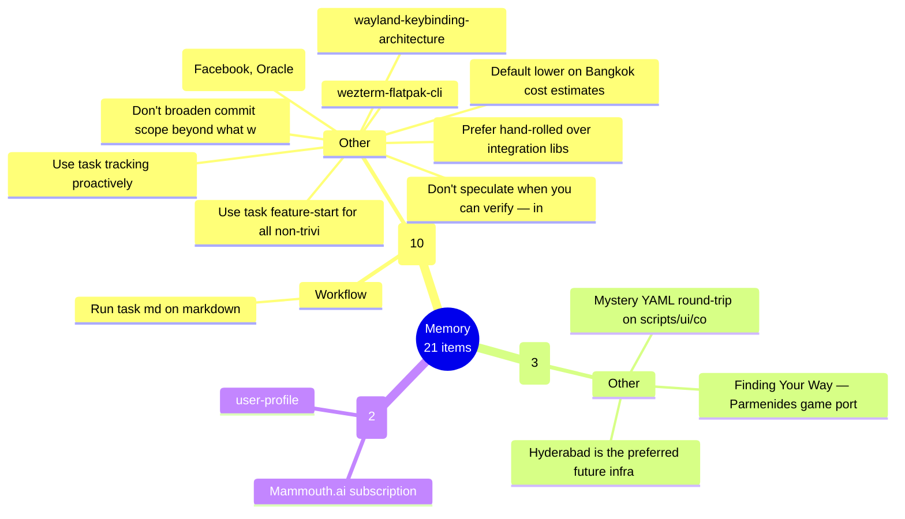
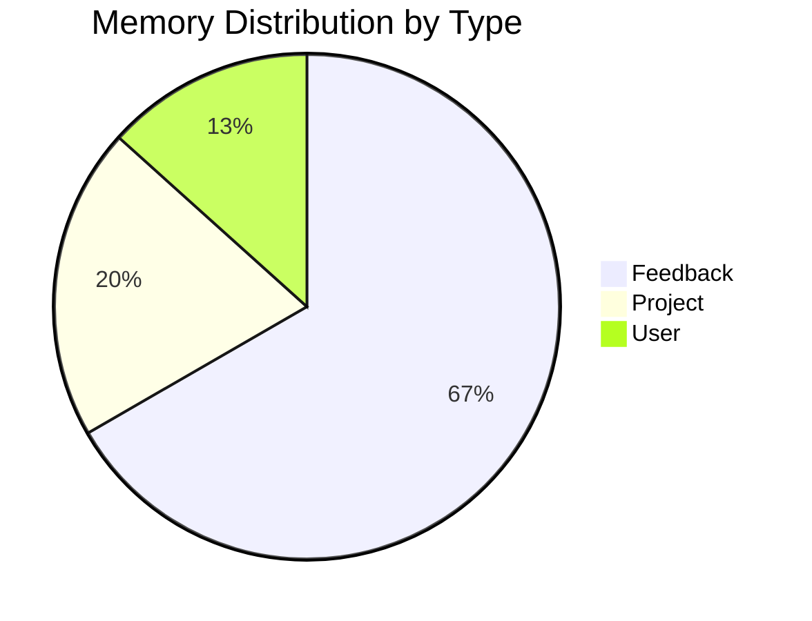
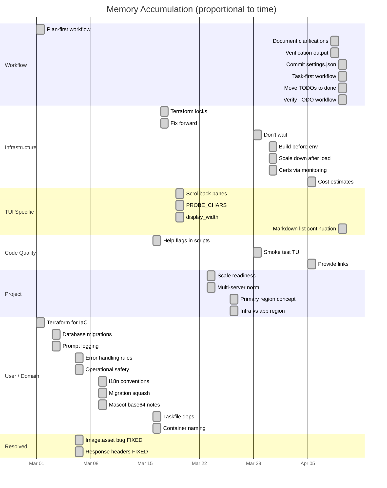
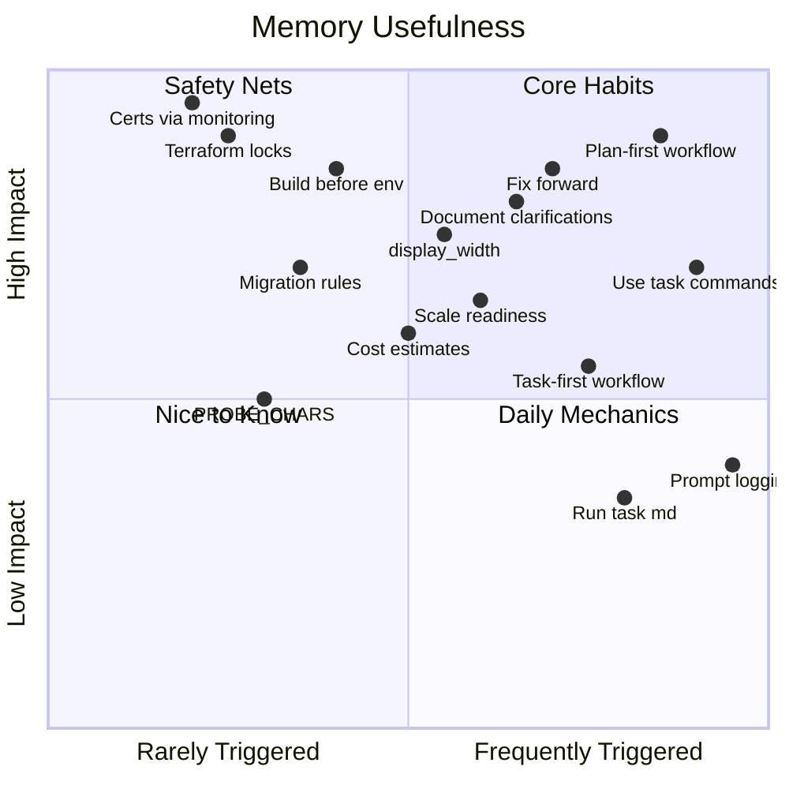
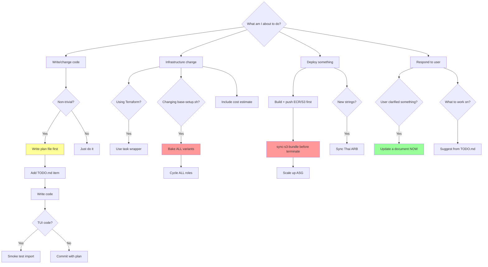
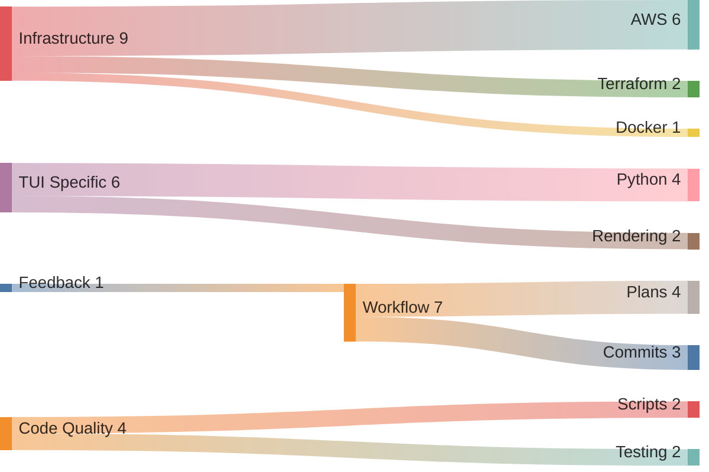
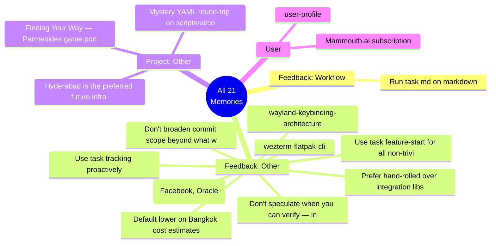

# Memory Visualizations

21 memories across 4 types, generated 2026-05-20 14:37.

---

## 1. Mindmap — Full Memory Landscape



## 2. Treemap — Category Proportions

```
+--------------------------------------------------------------------+
|                                                                    |
|                     FEEDBACK (10 items — 48%)                      |
|                                                                    |
|  +-----------------------------+  +-----------------------------+  |
|  |         Workflow (1)        |  |          Other (9)          |  |
|  |                             |  |                             |  |
|  | Run task md on markdown     |  | Default lower on Bangkok... |  |
|  +-----------------------------+  | Don't broaden commit sco... |  |
|                                   | Excluded providers (Face... |  |
|                                   | Don't speculate when you... |  |
|                                   | Prefer hand-rolled over ... |  |
|                                   | ...+4 more                  |  |
|                                   +-----------------------------+  |
+--------------------------------------------------------------------+
+--------------------------------+  +--------------------------------+
|        PROJECT (3/14%)         |  |          USER (2/10%)          |
+--------------------------------+  +--------------------------------+
```

## 3. Pie Chart — Distribution by Type



## 4. Timeline — When Memories Were Learned



## 5. Quadrant Chart — Memory Impact vs Frequency



## 6. Flowchart — Decision Tree for Common Situations



## 7. Sankey — How Memories Connect to Project Areas



## 8. Block Diagram — Memory by Concern Layer

```
                        +---------------------------------+
                        |          USER INTENT            |
                        |  plan-first | prompt logging    |
                        |  suggest TODO | document clarify|
                        +---------------------------------+
                                      |
                        +---------------------------------+
                        |         CODE QUALITY            |
                        |  refactoring ok | help flags    |
                        |  smoke test | display_width     |
                        |  task-first | commit settings   |
                        +---------------------------------+
                                      |
              +-------------------+---+---+-------------------+
              |                   |       |                   |
    +---------+--------+ +-------+-----+ +---------+---------+
    |     FRONTEND     | |   BACKEND   | |        TUI        |
    |                  | |             | |                   |
    | i18n (Thai sync) | | migrations  | | PROBE_CHARS       |
    | AssetManifest    | | error logs  | | scrollback        |
    | container naming | | MetricsCol  | | unicode boxes     |
    +------------------+ +-------------+ | mermaid <br/>     |
                                         +-------------------+
                                      |
                        +---------------------------------+
                        |        INFRASTRUCTURE           |
                        |  terraform only | task wrappers |
                        |  fix forward | bake ALL variants|
                        |  build before scale | tf locks  |
                        |  no LE on instances | costs     |
                        +---------------------------------+
                                      |
                        +---------------------------------+
                        |          OPERATIONS             |
                        |  sync-s3 before terminate       |
                        |  scale down after load tests    |
                        |  don't wait — monitor + report  |
                        |  certs via monitoring server    |
                        +---------------------------------+
```

## 9. Complete Memory Listing



## 10. Full Memory Contents

<table>
<tr><th>#</th><th>File</th><th>Name</th><th>Type</th><th>Project</th></tr>

<tr style="background:#f0f0f0"><td>1</td><td><code>feedback_bangkok_cost_estimates.md</code></td><td>Default lower on Bangkok cost estimates</td><td>feedback</td><td><i style="color:#888">general</i></td></tr>
<tr><td colspan="5">When estimating any Bangkok-specific cost — food prices, rent (commercial or residential), delivery fees, labor, services — <b>default to local-market norms, not Western/expat-tier numbers</b>. Will lives in Bangkok and corrects upward over-estimates.<br/><br/>

<b>Why:</b> In one session (2026-04-25 restaurant concept), I overshot three times in a row:
- Burger price: estimated 280–320 THB (mid-upper-tier expat range) → actual context was working-class condo, real ceiling 150–180 THB
- Soi commercial rent: estimated 180–240k THB/yr (retail-unit pricing) → actual stall-row arrangements are 10–25k THB/yr (informal monthly fee to juristic 500–2k, or daily slot fee 50–150)
- Delivery fee: estimated 80–100 THB for a few-hundred-meter walk → realistic is 30–50 THB; Lalamove/Grab Express deliver farther for ~50<br/><br/>

<b>How to apply:</b> Before stating a Bangkok cost range, check:
1. <b>Demographic context first</b> — working-class soi, mid-tier condo, expat-targeted, luxury? Each has wildly different price ceilings. Don't assume Sukhumvit pricing if the locale is residential/working-class.
2. <b>Compare against actual local market signals</b> — GrabFood, LineMan, Lalamove, Or Tor Kor, Makro, street-stall rows. These are the customer's real reference points, not Thonglor restaurant menus.
3. <b>Stall/cart/informal arrangements are 10–100× cheaper than retail-unit equivalents</b> in Bangkok. If an operation slots into an existing vendor row, rent is token (sometimes free); don't price as if it were a leased shopfront.
4. <b>When uncertain, give a wide range and flag the uncertainty</b> rather than confidently stating a high number — Will will correct downward and the conversation is faster if I admit I don't know the local norm.<br/><br/>

This is a recurring pattern, not a one-off correction — when working on anything Bangkok-economic, lean low.</td></tr>

<tr><td>2</td><td><code>feedback_claude_usage_wontfix.md</code></td><td>feedback_claude_usage_wontfix</td><td>unknown</td><td>claude-usage</td></tr>
<tr><td colspan="5">Before raising any issue in a claude-usage code review, check <code>/home/will/SRC/claude-usage/docs/wont-fix.md</code>. It lists all permanently deferred items with their rationale. Re-raising a won't-fix item wastes review cycles.<br/><br/>

<b>Why:</b> BUG-4, BUG-5, BUG-6, CQ6-6, CQ6-7, and CQ8 were each flagged multiple times across 7 review passes before being formally closed. A reference doc prevents that recurrence.<br/><br/>

<b>How to apply:</b> At the start of any code review pass on claude-usage, read <code>docs/wont-fix.md</code>. When a new item is permanently deferred (won't-fix, not-a-bug, by-design), add it to that file in the same commit as the decision.</td></tr>

<tr style="background:#f0f0f0"><td>3</td><td><code>feedback_commit_scope.md</code></td><td>Don't broaden commit scope beyond what was asked</td><td>feedback</td><td><i style="color:#888">general</i></td></tr>
<tr><td colspan="5">When the user requests a commit ("commit", "commit the others", "commit those"),
the scope is whatever the conversation has just enumerated — typically the
specific files I named in my previous message. <b>Do not</b> widen that to "every
file git status shows as modified or untracked."<br/><br/>

<b>Why:</b> Pre-existing pending work in <code>git status</code> is often there *deliberately* —
queued for reasons the user has but I haven't been told. Sweeping it into a
commit batch (even with thoughtful per-file commit messages) ships work that
wasn't ready and forces a revert. CLAUDE.md says it explicitly: "stage only the
files you modified, verify git diff --cached matches what you touched, and leave
any other in-progress changes unstaged."<br/><br/>

Specific incident (2026-05-08): Previous message had listed two specific
preserved-unstaged files (<code>SRC/free-services.md</code>, <code>MEMORY.md</code>). User said
"commit the others, sure". I read "the others" as "every pending modification
in the repo" and made 6 commits spanning settings.json, glossary, three
projects' memory dirs, and an investigation doc. User had to ask for a revert.
The right reading was: the two files I'd just enumerated.<br/><br/>

<b>How to apply:</b>
- Pronouns resolve against the *conversation*, not the working tree. Re-read my
  own most recent message before staging.
- If "the others" is genuinely ambiguous (no clear antecedent), ask one
  clarifying question or take the narrowest reading. Both are fine in auto mode.
- Auto mode shortcuts permission prompts, not scope. It is not a license to
  expand what was requested.
- Pre-existing pending state that didn't come up in this conversation is *not
  mine to commit* even if I'm the sole apparent author.</td></tr>

<tr><td>4</td><td><code>feedback_excluded_providers.md</code></td><td>Excluded providers (Facebook, Oracle)</td><td>feedback</td><td><i style="color:#888">general</i></td></tr>
<tr><td colspan="5">Do not include Facebook/Meta-owned services or Oracle as recommended providers in any cross-project doc (free-services.md), infra plan, tooling list, or suggested-next-steps.<br/><br/>

Note on Oracle Cloud: the "Always Free" 4-core ARM VM is widely cited as a generous free tier, but it isn't really — capacity is chronically exhausted in most regions and obtaining an instance often requires running retry loops for hours or days. So the exclusion costs us nothing; don't frame it as a sacrifice.<br/><br/>

<b>Exception:</b> WhatsApp remains in active use and is supported — Will heavily uses it personally, so WhatsApp Business API, deep-linking, share intents, etc. are fair game when relevant. The exclusion is on Facebook/Instagram/Threads/Messenger/Meta-as-platform, not on the Meta corporate umbrella in the abstract.<br/><br/>

<b>Why:</b> Stated preference (2026-05-06) when reviewing the OG/unfurl debugging table — "remove facebook as a provider, in general" and "same for oracle". Long-standing aversion to both companies as platforms, with WhatsApp as the explicit personal carve-out.<br/><br/>

<b>How to apply:</b>
- When adding rows to free-services.md or similar provider tables, skip Facebook Sharing Debugger, FB Login, Graph API, Instagram API, Oracle Cloud, Oracle DB, etc.
- When recommending free-tier infra, don't mention Oracle Cloud's Always Free — and don't treat it as the "best on paper" baseline either, since real-world availability makes the offer largely fictional.
- For OG/unfurl debugging, opengraph.xyz already covers the Facebook crawler preview without needing a Facebook account, so use it as the stand-in.
- WhatsApp is fine; do not let "Meta exclusion" sweep it up.</td></tr>

<tr style="background:#f0f0f0"><td>5</td><td><code>feedback_indri_store_badges.md</code></td><td>feedback_indri_store_badges</td><td>unknown</td><td><i style="color:#888">general</i></td></tr>
<tr><td colspan="5">Don't mention store badge <code>"#"</code> placeholder links (B3 from the 2026-05-14 code review) until the apps are actually published on the stores. The user explicitly doesn't care about this until then.<br/><br/>

<b>Why:</b> Pre-launch placeholder UX is not worth tracking or surfacing. The user will address it naturally when real store URLs are added.<br/><br/>

<b>How to apply:</b> In any review, TODO suggestion, or conversation touching indri.studio's <code>StoreBadges.astro</code> or store link frontmatter, skip the <code>href="#"</code> issue entirely until post-launch.<br/><br/>

Also: short-lived Cloudflare API tokens don't need rotation advice — the user confirmed these are ephemeral and self-expiring.</td></tr>

<tr><td>6</td><td><code>feedback_md_renderer_no_autolinks.md</code></td><td>feedback-md-renderer-no-autolinks</td><td>unknown</td><td>python-tui-lib</td></tr>
<tr><td colspan="5"># The rule<br/><br/>

<b>Every URL or external reference in a markdown file gets a real link.</b> This is broader than "third-party products" — it includes:<br/><br/>

- Products, libraries, frameworks, fonts, design systems, tools (Astro, Tailwind, Space Grotesk, Inter, GitHub Actions)
- Third-party websites, blog posts, docs (MDN, Wikipedia, clerk.com, hoox archive)
- People, foundries, organizations (Florian Karsten, Rasmus Andersson, Google Design)
- <b>Local dev URLs</b> (<code>localhost:4321</code> in a verification step)
- <b>Production URLs</b> (the actual deployed site you're verifying)
- Specific deep URLs (the apex vs www, a specific route, a doc anchor)<br/><br/>

If it's a URL, link it. If it's a name that maps to a URL, link it with that URL. <b>Bare names or URLs in plain text are a defect.</b><br/><br/>

Use <b><code>[label](url)</code></b> form. Never use <b><code><https://…></code></b> shorthand: the shared <code>~/SRC/python-tui-lib/scripts/md-to-pdf.sh</code> regex (<code>re.sub(r'\[([^\]]+)\]\(([^)]+)\)', ...)</code>) has no rule for angle-bracket autolinks and silently drops them, leaving a blank where the URL should be. Even when the URL is the label (e.g. <code>clerk.com</code> linking to <code>https://clerk.com</code> or <code>localhost:4321/colophon</code> linking to <code>http://localhost:4321/colophon</code>), still write it as <code>[label](url)</code>.<br/><br/>

# Why this gets its own loud memory<br/><br/>

This is a <b>recurring blind spot</b> Will has called out repeatedly:<br/><br/>

- The original <code><url></code> autolinks failure (twice in indri.studio, flagged session <code>a2f3a3df</code>).
- Inert product names in the colophon-route plan (2026-05-13): wrote <code>Astro 6</code>, <code>Tailwind CSS v4</code>, <code>Cloudflare Workers</code>, <code>Terraform</code>, <code>AWS SSM</code>, <code>GitHub Actions</code>, <code>pnpm</code>, <code>Space Grotesk</code>, <code>Inter</code>, <code>Material Symbols Outlined</code>, <code>Hoox</code>, <code>clerk.com</code>, <code>droneland.au</code> — every single one a bare name pointing at a real external thing, none linked. Will: *"this really is a blind spot for you. i do have to remind you to do it all the fucking time."*
- <b>Same plan, verification section</b> (2026-05-13, same day, after rewriting this memory): <code>localhost:4321</code> and <code>localhost:4321/colophon</code> in code-backticks rather than as links; no production URL mentioned at all. Will: *"it's funny that you don't have a link to the prod url in verification."* I had narrowed the rule in my head to "third-party products"; it applies equally to dev URLs and production URLs.<br/><br/>

Each failure is a different surface (paragraph autolinks → list of products → references → docs → local dev/prod URLs), but the underlying mistake is identical: I treat anything-that-could-be-a-link as plain text instead of as a link.<br/><br/>

# How to apply<br/><br/>

<b>Default behavior before any markdown lands:</b> scan the diff for proper nouns / capitalized names / bare hostnames that refer to external things. If a noun refers to an external product, library, font, framework, person, blog, website, or service that has a canonical URL — link it. Even if the URL feels obvious. Even if it appears multiple times. The reader should be able to *click* every external reference.<br/><br/>

Examples — left side wrong, right side right:<br/><br/>

- <code>Astro 6 — static site generation</code> → <code>[Astro 6](https://astro.build) — static site generation</code>
- <code>Tailwind CSS v4</code> → <code>[Tailwind CSS v4](https://tailwindcss.com)</code>
- <code>Space Grotesk</code> → <code>[Space Grotesk](https://fonts.google.com/specimen/Space+Grotesk)</code>
- <code>clerk.com</code> → <code>[clerk.com](https://clerk.com)</code>
- <code>Built with Hoox</code> → <code>Built with [Hoox](https://hoox-archive-or-similar.example)</code>
- <code>Open <https://example.com/docs></code> → <code>Open [example.com/docs](https://example.com/docs)</code><br/><br/>

<b>Audit step</b>: before declaring a markdown file done, grep mentally (or actually) for the names of external products/sites in it. If any appear without surrounding <code>[…](…)</code>, that's a bug.<br/><br/>

Related: [[feedback-run-task-md]] (the workflow rule that triggers the render), [[feedback-public-vs-internal-surfaces]] (don't include *internal* references at all — but the external ones that *do* belong must be linked).</td></tr>

<tr style="background:#f0f0f0"><td>7</td><td><code>feedback_no_speculation.md</code></td><td>Don't speculate when you can verify — including claims about state</td><td>feedback</td><td><i style="color:#888">general</i></td></tr>
<tr><td colspan="5">Two failure modes Will has called out, same root cause:<br/><br/>

1. <b>Advising from guesses</b> when asked a factual question or giving troubleshooting advice. Listing "common causes" / hypothetical checklists when the specific answer is one command away.
2. <b>Asserting state as fact</b> when it's actually unchecked — "the params don't exist yet anyway", "tf-apply hasn't run", "the file is empty" — declarative claims that sound authoritative but are speculation dressed as observation.<br/><br/>

Either way: <b>check the actual source before answering or asserting.</b> Use RDAP/WHOIS for domains, read files for config, query APIs for AWS/cloud resource state, look at the screenshot the user already provided. When you can't check, say "I don't know, here's what we can check" — never claim what you haven't verified.<br/><br/>

<b>Why:</b> Will has pushed back four+ times across sessions:
- Domain expiration date — speculated instead of <code>curl</code>ing RDAP ("you don't need to speculate, heh").
- WHOIS privacy blocking a transfer — listed it as a likely cause when the user's screenshot already showed it green-checked.
- Dreamhost panel URL / Approve button — described from memory of docs rather than current observation; the button wasn't present.
- AWS SSM param existence after a <code>task tf-apply</code> — declared "the params don't exist yet anyway, tf-apply hasn't run" without running <code>aws ssm get-parameter</code>; the param had been created hours earlier. Will: *"how would you know? cuz you didn't even look"*.<br/><br/>

The declarative-state mode is the more painful one because the assertion gets baked into recommendations ("run tf-apply first") that send the user down a wrong path.<br/><br/>

<b>How to apply:</b>
- Before listing hypotheticals or generic troubleshooting steps, ask: can I look up the truth right now? If yes, do that first and answer from data.
- Before saying "X hasn't happened" / "Y doesn't exist" / "the script wasn't run", run the check (<code>aws ssm get-parameter</code>, <code>gh run list</code>, <code>git log</code>, <code>stat file</code>, etc.). If the check costs nothing and reveals truth, there's no excuse to skip it.
- When you can't check (offline, missing creds, etc.), say so explicitly: "I haven't verified; let me query" or "I don't know — here's what we can check." Never paper over the gap with a confident-sounding claim.
- Reserve checklists for cases where the state genuinely isn't observable.</td></tr>

<tr><td>8</td><td><code>feedback_prefer_proper_fix.md</code></td><td>feedback-prefer-proper-fix</td><td>unknown</td><td><i style="color:#888">general</i></td></tr>
<tr><td colspan="5">When presenting fix options between a minimal/targeted fix and a proper/architectural one, <b>default to the proper one</b>. Don't lead with the minimal fix as "recommended" just because it's smaller. If both options are real, present the architectural one as the default unless the user has indicated they want surgical scope.<br/><br/>

<b>Why:</b> When offered A (targeted) vs B (proper) for the indri.studio cross-page header animation issue, I marked A as "recommended" and B as a "bigger architectural call." Will responded: *"i want it solved properly, ofc. have we met? heh. remember that"* — making clear this is a standing preference, not specific to that one decision. The minimal fix is a workaround; the proper fix removes the underlying constraint.<br/><br/>

<b>How to apply:</b> When framing fix options, lead with the architectural answer. Only suggest the targeted version if it offers something the proper version doesn't (e.g., reversibility, lower risk under a deadline). Don't preemptively shrink scope to "save effort" — Will sees that as anchoring on the wrong default. Related: [[feedback-renaming-and-refactors-welcome]] cascade rule from <code>~/SRC/CLAUDE.md</code> ("Renaming and large refactors are welcome. The only constraint is nothing breaks.") — same shape, applied to all sized changes.</td></tr>

<tr style="background:#f0f0f0"><td>9</td><td><code>feedback_public_vs_internal_surfaces.md</code></td><td>feedback-public-vs-internal-surfaces</td><td>unknown</td><td><i style="color:#888">general</i></td></tr>
<tr><td colspan="5">When drafting copy for public-facing pages, keep internal/infrastructure details out. Audit for and cut: repo URLs, predecessor-project references, deploy pipeline specifics, SSM/IaC paths, the names of internal companion projects (e.g. "finding-your-way's infrastructure pattern"), and "where the source code lives" links. The colophon is the obvious trap — a colophon describes the *visible craft* (type, palette, stack at a high level), not the development infrastructure.<br/><br/>

<b>Why:</b> On the indri.studio colophon plan, Will cut two sections in a row for this reason:<br/><br/>

1. A "Predecessors and patterns" block (mentioned rapid-raccoon.com as the prior site and finding-your-way as the infrastructure pattern source). Will: *"yeah, not"* — inside-baseball, leaks internal project structure onto a public page.
2. A SOURCE section (repo URL, plans path, deploy pipeline note). Will: *"do you know why?"* — testing whether I understood. Same logic: repos for a marketing site are typically private, and a colophon's job is craft on display, not pointing at the source tree.<br/><br/>

<b>How to apply:</b> Before any public-page content lands, scan it for: (a) names of other internal projects, (b) repo/source links, (c) deployment/CI mechanics — including tag patterns and build commands like <code>wrangler deploy</code>, (d) IaC or secret-storage paths — including project-root prefixes like <code>/indri-studio/</code> in SSM, (e) migration history that names the prior brand. If it's there, cut or generalize. Mention stack at a category level ("Cloudflare Workers", "Astro 6", "AWS SSM Parameter Store", "GitHub Actions") not at an operational level ("<code>/indri-studio/cloudflare/api_token</code> in SSM", "<code>v*</code> tags trigger <code>wrangler deploy</code>").<br/><br/>

<b>Reinforce: audit existing drafts when the rule is fresh.</b> On the colophon plan I wrote the rule down as a memory after Will cut two leaks (predecessors, SOURCE) — then immediately failed to scan the rest of the THE STACK list against the same rule. Will had to point out two more leaks (SSM path suffix, GitHub Actions tag-pattern parenthetical) one entry at a time. Writing the rule down isn't application; <b>when a new rule is identified mid-task, retroactively scan the existing draft for the same pattern before declaring it done</b>. Note: this is distinct from the visual-fingerprint concern in [[feedback-seed-dont-clone]] — that one is about *aesthetic* leakage between sister sites; this one is about *infrastructure* leakage onto a public surface.</td></tr>

<tr><td>10</td><td><code>feedback_run_task_md.md</code></td><td>Run task md on markdown files</td><td>feedback</td><td><i style="color:#888">general</i></td></tr>
<tr><td colspan="5">After writing or modifying any <code>.md</code> file (plans, docs, investigations, reports, prompts), run <code>task md -- {filename}</code> on it. <b>Never run <code>task md</code> on non-markdown files</b> (<code>.py</code>, <code>.dart</code>, <code>.sh</code>, <code>.json</code>, etc.).<br/><br/>

<b>Why:</b> User wants to preview markdown files in browser immediately after they're written. Running <code>task md</code> on Python or other source files is wrong — it passes non-markdown content to the markdown renderer.<br/><br/>

<b>How to apply:</b> A PostToolUse hook on Write|Edit handles this automatically *only in projects that have it configured* (e.g. parking-space's <code>.claude/settings.local.json</code>). In the homedir context (or any project without that hook), run <code>task md -- {filename}</code> manually after editing a <code>.md</code> file. If manually triggering, only pass <code>.md</code> file paths. If you just edited a Python script that generates a <code>.md</code> file, run <code>task md</code> on the *output* <code>.md</code> file, not the script itself.</td></tr>

<tr style="background:#f0f0f0"><td>11</td><td><code>feedback_seed_dont_clone.md</code></td><td>feedback-seed-dont-clone</td><td>unknown</td><td><i style="color:#888">general</i></td></tr>
<tr><td colspan="5">When user asks to seed a new site from an existing template (e.g., indri.studio from rapid-raccoon-site), do NOT just swap the wordmark and accent color and call it adapted. The visual fingerprint of the source — italicized lowercase headline style, dot-grid background, glass-card components, Material-style token names, header/footer rhythm — all carry through unchanged and the result looks like a recolored clone of the source.<br/><br/>

<b>Why:</b> Will explicitly walked us through inspiration sites (Hoox, clerk.com, Droneland) and articulated a distinct brand vocabulary (ringtail greys, neon Phosphor purple, pixel-grid motion bands, stripe motif). I seeded from rapid-raccoon-site, swapped cyan to purple, and stopped. Will's reaction: "you made me a site that looks like every other site you've already made me, heavy sigh." Right.<br/><br/>

<b>How to apply:</b><br/><br/>

1. <b>Plan the distinctive elements first, build them first.</b> The signature visual (StripedGridMotion in this case, or whatever the brand's anchor is) ships in the same iteration as the seed, not as a follow-up. The seed without the distinctive elements is a clone with a different name.<br/><br/>

2. <b>Audit the seed for fingerprint elements before adapting.</b> Things to interrogate: wordmark style (italic? lowercase? all-caps? size?), background texture (dots? gradient? noise? plain?), component shapes (glass-card? hard borders? brutalist blocks?), token naming (Material? custom?), header layout, footer layout, section rhythm. If the inspiration brief diverges on any of these, change them BEFORE shipping the first commit.<br/><br/>

3. <b>Cross-check against inspiration sites concretely.</b> For each piece of structural copy (e.g., "italicized lowercase 'indri'"), can the user point to the inspiration site (Hoox / clerk / etc.) and say "yes, that"? If not, it's a seed fingerprint, not a brand choice.<br/><br/>

4. <b>"Mechanical color swap" is the failure mode.</b> If the only diff from the source is <code>s/cyan/purple/g</code> + wordmark text, the result will read as a clone. Need at least one of: structural change (section rhythm), texture change (bg replacement), or signature component added (motion module, distinctive imagery).<br/><br/>

5. When the user has gone through the effort of articulating a brand brief, <b>respect the brief by execution</b>, not by future intent. "We'll add the motion module later" is a polite way to ship a generic site now.<br/><br/>

Related: [[feedback-tooling-choices]] — same family: do the distinctive work, don't defer it.</td></tr>

<tr><td>12</td><td><code>feedback_tooling_choices.md</code></td><td>Prefer hand-rolled over integration libs when Will already does the manual pattern</td><td>feedback</td><td>gustos-colores, parking-space</td></tr>
<tr><td colspan="5"><b>Rule:</b> When proposing tooling for a pattern Will already implements by hand
(PWA service workers + manifests being the canonical example), default to the
hand-rolled approach rather than reaching for an integration library. If the
integration library has real non-convenience advantages, state them honestly and
briefly — don't oversell.<br/><br/>

<b>Why:</b> Will pushed back on <code>@vite-pwa/astro</code> with "we've made several PWA apps
together already and it didn't seem to be painful." Reference projects:
<code>~/SRC/parking-space</code> and <code>~/SRC/gustos-colores</code>. He finds framework-wrapper convenience
less valuable than a stable, portable, well-understood pattern across projects.<br/><br/>

<b>How to apply:</b> Before recommending an integration library (vite plugins, framework
integrations, wrapper SDKs), ask: does Will already do this manually in another
project? If yes, lead with the hand-rolled path and only mention the lib if it
adds something real (auto-regenerated config, dev-mode features) — and name the
specific win, not "convenience."<br/><br/>

<b>Related preference:</b> For content-migration tasks, convert to Markdown upfront
rather than starting with HTML and migrating later — avoid doing the conversion
twice. Established during the Parmenides/finding-your-way plan ("let's just start
with markdown from the beginning").</td></tr>

<tr style="background:#f0f0f0"><td>13</td><td><code>feedback_use_feature_workflow.md</code></td><td>Use task feature-start for all non-trivial work</td><td>feedback</td><td><i style="color:#888">general</i></td></tr>
<tr><td colspan="5">For any non-trivial task in <code>parking-space</code>, <b>start by running <code>task feature-start NAME=<slug></code> from the main checkout</b>. Do not create plan files directly in <code>plans/</code> and do not work on <code>main</code>.<br/><br/>

<b>Why:</b> The legacy flow used a <code>PostToolUse</code> <code>Write</code> hook that auto-created <code>plan/<date>-<slug></code> branches in the shared checkout — silent branch switching, no source isolation, features colliding on <code>.env</code> and generated dirs. The hook was deleted on 2026-04-10 and replaced with explicit <code>task feature-start</code> + git worktrees under <code>.worktrees/<date>-<slug>/</code>. The new flow only works if I actually use it. The user explicitly reminded me of this after building it: *"YOU are the one that's going to have to start following the feature workflow, you know that, right?"*<br/><br/>

<b>How to apply:</b>
1. From <code>main</code> (no uncommitted changes): <code>task feature-start NAME=<slug></code>. This commits a plan skeleton + TODO entry on <code>main</code> and creates the worktree.
2. <code>cd .worktrees/<date>-<slug></code> and do all coding there. Open new Claude Code sessions in that directory if needed.
3. Only one worktree at a time can run <code>task dev</code> (postgres/redis/backend ports are fixed). To switch active dev: <code>task dev-stop</code>, then <code>task dev</code> in the new worktree.
4. When done: <code>task feature-finish</code> from inside the worktree — handles merge / push PR / keep / discard and tears down the dev stack if owned.<br/><br/>

<b>Exceptions</b> (where staying on <code>main</code> is fine):
- Trivial fixes (typo, single-line edit, status check).
- Work that's already in progress on <code>main</code> when this rule was introduced — finish it where it is, then start using the flow on the next task.
- Read-only investigation.<br/><br/>

<b>Reference:</b> [docs/feature-workflow.md](../../../SRC/parking-space/docs/feature-workflow.md), [plans/2026-04-10-feature-worktree-flow.md](../../../SRC/parking-space/plans/2026-04-10-feature-worktree-flow.md).</td></tr>

<tr><td>14</td><td><code>feedback_use_task_tracking.md</code></td><td>Use task tracking proactively</td><td>feedback</td><td><i style="color:#888">general</i></td></tr>
<tr><td colspan="5">When a request will span more than ~3 tool calls or includes multiple discrete
sub-asks (research + iterate + repeat), start with <b>TaskCreate</b> to lay out the
sub-tasks, then <b>TaskUpdate</b> as each completes. Don't wait for the
auto-reminder — by the time it fires, the task list is already overdue.<br/><br/>

<b>Why:</b> User has explicitly called out the pattern of repeatedly ignoring the
harness's task-tool reminders. Treating those reminders as system noise instead
of course corrections is the bug; the fix is to make task creation a default at
the start of multi-step arcs, not a reaction.<br/><br/>

<b>How to apply:</b>
- At the start of any task that will involve research + multiple file edits +
  iteration (e.g., the "find cheapest registrar" arc with 5+ rounds of plan
  edits), create a TaskList up front.
- Update tasks as I go — mark in_progress when starting, completed when done.
- For genuinely single-step requests (one edit, one lookup), skip it — task
  tracking should not become ceremony.
- If the user adds new sub-asks mid-flow ("also add worldfoundry.org", "also
  the email question"), append them to the task list rather than just absorbing
  them silently.</td></tr>

<tr style="background:#f0f0f0"><td>15</td><td><code>feedback_wayland_keybindings.md</code></td><td>wayland-keybinding-architecture</td><td>feedback</td><td><i style="color:#888">general</i></td></tr>
<tr><td colspan="5">GNOME custom keybindings intercept ALL apps (XWayland and Wayland-native). The key is consumed before apps see it. For Wayland apps, ydotool sends synthetic keys via /dev/uinput but CANNOT clear physically-held modifiers — Mutter combines modifier state across all keyboards. So ydotool's Ctrl+PageDown arrives as Ctrl+Shift+PageDown when user holds Shift. Both WezTerm and Ptyxis are configured to switch tabs on Ctrl+Shift+PageDown to work around this.<br/><br/>

<b>Why:</b> Spent significant time discovering this through trial and error. xdotool --clearmodifiers works for XWayland but nothing equivalent exists for Wayland.<br/><br/>

<b>How to apply:</b> When adding keybinding remaps involving modifier keys on Wayland, account for physically-held modifiers combining with synthetic events.</td></tr>

<tr><td>16</td><td><code>feedback_wezterm_flatpak.md</code></td><td>wezterm-flatpak-cli</td><td>feedback</td><td><i style="color:#888">general</i></td></tr>
<tr><td colspan="5">WezTerm Flatpak CLI access requires <code>flatpak enter <instance></code>, not <code>flatpak run --command=wezterm</code> (which creates a new sandbox that can't connect). Must connect to the GUI socket (<code>gui-sock-*</code>), not the mux socket (<code>sock</code>) — only the GUI socket sees actual GUI tabs.<br/><br/>

<b>Why:</b> <code>flatpak run</code> spawns a new sandbox. <code>wezterm cli list</code> via mux socket shows 1 tab per window; GUI socket shows all tabs.<br/><br/>

<b>How to apply:</b> When scripting WezTerm tab operations (workspace launcher, tab switching), always use <code>flatpak enter</code> + <code>WEZTERM_UNIX_SOCKET=<gui-sock></code>.</td></tr>

<tr style="background:#f0f0f0"><td>17</td><td><code>project_config_yaml_mystery_roundtrip.md</code></td><td>Mystery YAML round-trip on scripts/ui/config.yaml (2 sightings; watcher ready)</td><td>project</td><td><i style="color:#888">general</i></td></tr>
<tr><td colspan="5"><b>2026-04-23 — second sighting.</b> Same damage signature: comments stripped, <code>⏲</code>/<code>⏱</code> → <code>⏲</code>/<code>⏱</code>, blank-line separators collapsed, plus value changes <code>provider: ollama</code> → <code>mammouth</code> and <code>api_model: gemini-2.5-flash</code> → <code>grok-4-1-fast</code>. Explore agent re-ran the write-path hunt across all committed code (LLM picker hooks, <code>yaml.dump</code>/<code>ruamel</code> imports, <code>open(config_path,'w')</code>, new helpers since 2026-04-20) — <b>still zero matches</b>. Writer is outside committed source (past-session eval, external tool, IDE autosave). User chose full revert via <code>git checkout</code> over preserving the value changes. The watcher (already in place since 2026-04-20, commit 60b3803d) was smoke-tested this session and works — but was not running when the write happened, so the culprit remains unknown. User needs a background terminal with <code>task watch-config-yaml</code> to catch the next one.<br/><br/>

<b>What happened (2026-04-20, original sighting):</b> Found <code>scripts/ui/config.yaml</code> with uncommitted changes: all comments stripped (including a large provider-examples block), unicode icons escaped (<code>⏲</code> → <code>⏲</code>, <code>⏱</code> → <code>⏱</code>), blank section separators collapsed, and <code>provider: ollama</code> → <code>provider: mammouth</code>. Classic <code>yaml.safe_load()</code> + <code>yaml.safe_dump()</code> signature.<br/><br/>

<b>Why (still unknown):</b> Exhaustive grep across main + all then-active worktrees for <code>yaml.dump</code>, <code>safe_dump</code>, <code>dump_all</code>, <code>ruamel</code>, <code>yq</code>, <code>sed.*config.yaml</code>, any <code>open(...'w')</code> targeting config.yaml — zero matches on both the 2026-04-20 pass and the 2026-04-23 re-pass. The LLM picker mixin mutates <code>_llm_config</code> in-memory only (overrides at <code>scripts/chat/__main__.py</code>, <code>tui_about.py</code>, <code>logs.py</code>, <code>view/__main__.py</code> as of 2026-04-23). Live persistence paths in committed code go to <code>~/.config/parking-space-tui/keys.env</code> or <code>scripts/tui/log_views.yaml</code>, never to config.yaml.<br/><br/>

<b>Watcher (commit 60b3803d, 2026-04-20):</b> <code>scripts/watch-config-yaml.sh</code> + <code>task watch-config-yaml</code>. inotifywait on <code>scripts/ui/</code> with <code>close_write,modify,moved_to,create</code>. On each event the log gets md5 + first 5 lines of the target (distinguishes clean vs round-tripped content at a glance), xdotool active-window name/PID (XWayland only — Wayland-native apps show blank), <code>fuser</code>/<code>lsof</code> on the file, and <code>ps --sort=-start_time</code> top 15. Log: <code>~/.cache/parking-space-tui/config-yaml-writes.log</code>. Smoke-test 2026-04-23: synthetic <code>yaml.safe_load+safe_dump</code> via <code>python3 -c</code> was captured correctly — even though the python child exited before the ps snapshot, its parent bash (and the launching shell chain) was visible.<br/><br/>

<b>How to apply on next recurrence:</b>
1. <b>If watcher was running:</b> inspect <code>~/.cache/parking-space-tui/config-yaml-writes.log</code> — correlate event timestamp with the ps snapshot; the writer's parent is usually still in the list even if the direct writer was short-lived.
2. <b>If watcher was not running</b> (same failure mode as 2026-04-20 and 2026-04-23): the grep strategy is already exhausted — instead check for a long-running past-session Claude Code process (<code>ps -o lstart,cmd -p $(pgrep -f claude)</code>) that might be running stale yaml-dumping snippets. Then start the watcher immediately so the user doesn't have to wait for the *third* recurrence to capture it.</td></tr>

<tr><td>18</td><td><code>project_finding_your_way.md</code></td><td>Finding Your Way — Parmenides game port</td><td>project</td><td>finding-your-way</td></tr>
<tr><td colspan="5"><b>Fact:</b> The author of "Parmenides: Finding Your Way" asked Will to convert the
original 2005 hypertext (144 HTM pages + 19 images, pure hyperlink DAG — no scripts)
into a modern interactive game. Work lives at <code>~/SRC/finding-your-way/</code>. Plan at
<code>~/SRC/finding-your-way/docs/plans/PLAN.md</code> — verify against the file rather than
trusting this memory for current scope.<br/><br/>

<b>Phase plan (as of 2026-04-25, was originally 5 phases, now 7):</b>
1. Faithful port (Astro + Markdown from day one; converted via pandoc)
2. Responsive + PWA (hand-rolled SW + manifest)
3. Temple hub (visual return point between realm quests; localStorage visited-state)
4. UI modernization (Stitch + Claude collaboration)
5. Persistence, sharing, analytics
6. Atmosphere + PWA polish — 6a (ambient audio per realm), 6b (original Greek on endings), 6c (PWA auto-resume) all shipped
7. TBD — deferred candidates, ordered lowest-risk to highest-risk-of-cheapening-the-piece<br/><br/>

<b>Current status:</b> Phases 1–6 shipped. Project README status is "Mostly done —
awaiting possible author (Max) change requests." Phase 7 is the live TBD.<br/><br/>

<b>Stack decisions locked:</b> Astro, Markdown source, AWS S3 + CloudFront +
Terraform, ACM cert (not Let's Encrypt — different pattern from EC2-hosted projects),
hand-rolled PWA, ship to CloudFront default URL first (custom domain deferred). Live
at <https://d310bzn1p8934s.cloudfront.net>.<br/><br/>

<b>Source material:</b> <code>~/Downloads/Parmenides_ Finding your way-20230919T091147Z-001/Parmenides_ Finding your way/</code> (the original HTM + images + design doc). Do not edit — treat as read-only archive.<br/><br/>

<b>Why:</b> The content is already hypertext; porting into an IF authoring language
(Twine/Ink/Inform) was considered and rejected as needless indirection. A retired
philosopher-themed branching narrative; the author wants it accessible again.<br/><br/>

<b>Timeline:</b> Author's original request dates to 2023-11-19 (confirmed by Will 2026-04-20). No active deadline — pacing is self-directed. Use this to inform scope decisions: favor doing each phase right over shipping fast.<br/><br/>

<b>How to apply:</b> If user mentions "Parmenides", "finding your way", "temple hub",
"four realms", "Being/Not-Being", or references <code>~/SRC/finding-your-way/</code>, this is
the project. Read <code>docs/plans/PLAN.md</code> first before making suggestions — it has more
detail than this memory and is kept current.</td></tr>

<tr style="background:#f0f0f0"><td>19</td><td><code>project_hyderabad_future_home.md</code></td><td>Hyderabad is the preferred future infra home</td><td>project</td><td><i style="color:#888">general</i></td></tr>
<tr><td colspan="5">Current project infrastructure (build, monitoring, bastion) is in <b>Mumbai (ap-south-1)</b>. The preferred future home is <b>Hyderabad (ap-south-2)</b>.<br/><br/>

<b>Why:</b> Same S3 storage price as Mumbai ($0.025/GB-mo) and same cross-region/internet egress ($0.086/GB cross-region, $0.109/GB to internet), but <b>lower ping times</b> for project operators. No cost delta, just latency.<br/><br/>

<b>How to apply:</b> When ap-south-2 gains feature parity with ap-south-1 on the services this project uses (currently a blocker — e.g. some S3 / networking / launch-template capabilities), migrate the Mumbai infrastructure to Hyderabad. For any plan that involves choosing an Indian region now, pick Mumbai (feature-complete) but note Hyderabad as the target; for plans designed years out, assume Hyderabad. Do not pay a cost premium or accept feature gaps just to land in Hyderabad sooner.<br/><br/>

Bangkok (ap-southeast-7) remains the app primary region — unrelated to this infra-home choice.</td></tr>

<tr><td>20</td><td><code>user_mammouth_subscription.md</code></td><td>Mammouth.ai subscription</td><td>user</td><td><i style="color:#888">general</i></td></tr>
<tr><td colspan="5">Will has a €20/month Mammouth.ai Standard subscription. Includes €4 in API credits, access to GPT-4o, Claude, Gemini, Mistral, Llama (including Gemini 2.5 Flash) via a single OpenAI-compatible API at <code>https://api.mammouth.ai/v1</code>. API key at https://mammouth.ai/app/account/settings/api.<br/><br/>

Note: Gemini 2.5 Flash access via Mammouth is separate from Google Stitch (which is its own Google Labs product with its own free tier). Mammouth could be a fallback for Gemini-powered design critique if Stitch gets paywalled.</td></tr>

<tr style="background:#f0f0f0"><td>21</td><td><code>user_profile.md</code></td><td>user-profile</td><td>user</td><td><i style="color:#888">general</i></td></tr>
<tr><td colspan="5">Will is a developer running Ubuntu 25.04 (GNOME 49/Wayland) on a Dell Inspiron 14 7445 2-in-1 laptop. Uses WezTerm (Flatpak), Chrome (XWayland), and Ptyxis (GNOME Terminal) as primary apps. Runs multiple Claude Code sessions in WezTerm tabs for parallel development work. Comfortable with shell scripting, gsettings, dconf, systemd, and low-level Linux tooling. Prefers simple, pragmatic solutions — shell scripts over declarative configs when flexibility matters.</td></tr>

</table>

---

## [F] Feedback (10)

### Default lower on Bangkok cost estimates
**File:** `feedback_bangkok_cost_estimates.md`
**Description:** When estimating Bangkok prices/rents/fees, default to local-market norms not Western/expat-tier; verify against Lalamove/Grab/local norms before stating ranges

> When estimating any Bangkok-specific cost — food prices, rent (commercial or residential), delivery fees, labor, services — **default to local-market norms, not Western/expat-tier numbers**. Will l...

**Why:** In one session (2026-04-25 restaurant concept), I overshot three times in a row:
- Burger price: estimated 280–320 THB (mid-upper-tier expat range) → actual context was working-class condo, real ceiling 150–180 THB
- Soi commercial rent: estimated 180–240k THB/yr (retail-unit pricing) → actual stall-row arrangements are 10–25k THB/yr (informal monthly fee to juristic 500–2k, or daily slot fee 50–150)
- Delivery fee: estimated 80–100 THB for a few-hundred-meter walk → realistic is 30–50 THB; Lalamove/Grab Express deliver farther for ~50
**How to apply:** Before stating a Bangkok cost range, check:
1.

### Don't broaden commit scope beyond what was asked
**File:** `feedback_commit_scope.md`
**Description:** When the user says "commit X" or "commit the others," resolve the scope from the conversation's most recent enumeration — not from git status sweeping

> When the user requests a commit ("commit", "commit the others", "commit those"),

**Why:** Pre-existing pending work in `git status` is often there *deliberately* —
queued for reasons the user has but I haven't been told. Sweeping it into a
commit batch (even with thoughtful per-file commit messages) ships work that
wasn't ready and forces a revert. CLAUDE.md says it explicitly: "stage only the
files you modified, verify git diff --cached matches what you touched, and leave
any other in-progress changes unstaged."

Specific incident (2026-05-08): Previous message had listed two specific
preserved-unstaged files (`SRC/free-services.md`, `MEMORY.md`). User said
"commit the others, sure". I read "the others" as "every pending modification
in the repo" and made 6 commits spanning settings.json, glossary, three
projects' memory dirs, and an investigation doc. User had to ask for a revert.
The right reading was: the two files I'd just enumerated.
**How to apply:** - Pronouns resolve against the *conversation*, not the working tree. Re-read my
  own most recent message before staging.
- If "the others" is genuinely ambiguous (no clear antecedent), ask one
  clarifying question or take the narrowest reading. Both are fine in auto mode.
- Auto mode shortcuts permission prompts, not scope. It is not a license to
  expand what was requested.
- Pre-existing pending state that didn't come up in this conversation is *not
  mine to commit* even if I'm the sole apparent author.

### Excluded providers (Facebook, Oracle)
**File:** `feedback_excluded_providers.md`
**Description:** Do not recommend Facebook/Meta (except WhatsApp) or Oracle as providers in free-services.md, infra plans, or tooling suggestions

> Do not include Facebook/Meta-owned services or Oracle as recommended providers in any cross-project doc (free-services.md), infra plan, tooling list, or suggested-next-steps.

**Why:** Stated preference (2026-05-06) when reviewing the OG/unfurl debugging table — "remove facebook as a provider, in general" and "same for oracle". Long-standing aversion to both companies as platforms, with WhatsApp as the explicit personal carve-out.
**How to apply:** - When adding rows to free-services.md or similar provider tables, skip Facebook Sharing Debugger, FB Login, Graph API, Instagram API, Oracle Cloud, Oracle DB, etc.
- When recommending free-tier infra, don't mention Oracle Cloud's Always Free — and don't treat it as the "best on paper" baseline either, since real-world availability makes the offer largely fictional.
- For OG/unfurl debugging, opengraph.xyz already covers the Facebook crawler preview without needing a Facebook account, so use it as the stand-in.
- WhatsApp is fine; do not let "Meta exclusion" sweep it up.

### Don't speculate when you can verify — including claims about state
**File:** `feedback_no_speculation.md`
**Description:** Verify before asserting. Will pushes back on guessed/checklist advice AND on declarative claims about state ("X hasn't run", "Y doesn't exist") that weren't checked first

> Two failure modes Will has called out, same root cause:

**Why:** Will has pushed back four+ times across sessions:
- Domain expiration date — speculated instead of `curl`ing RDAP ("you don't need to speculate, heh").
- WHOIS privacy blocking a transfer — listed it as a likely cause when the user's screenshot already showed it green-checked.
- Dreamhost panel URL / Approve button — described from memory of docs rather than current observation; the button wasn't present.
- AWS SSM param existence after a `task tf-apply` — declared "the params don't exist yet anyway, tf-apply hasn't run" without running `aws ssm get-parameter`; the param had been created hours earlier. Will: *"how would you know? cuz you didn't even look"*.

The declarative-state mode is the more painful one because the assertion gets baked into recommendations ("run tf-apply first") that send the user down a wrong path.
**How to apply:** - Before listing hypotheticals or generic troubleshooting steps, ask: can I look up the truth right now? If yes, do that first and answer from data.
- Before saying "X hasn't happened" / "Y doesn't exist" / "the script wasn't run", run the check (`aws ssm get-parameter`, `gh run list`, `git log`, `stat file`, etc.). If the check costs nothing and reveals truth, there's no excuse to skip it.
- When you can't check (offline, missing creds, etc.), say so explicitly: "I haven't verified; let me query" or "I don't know — here's what we can check." Never paper over the gap with a confident-sounding claim.
- Reserve checklists for cases where the state genuinely isn't observable.

### Run task md on markdown files
**File:** `feedback_run_task_md.md`
**Description:** After writing or editing any .md file, run task md to convert it to HTML and open in browser

> After writing or modifying any `.md` file (plans, docs, investigations, reports, prompts), run `task md -- {filename}` on it. **Never run `task md` on non-markdown files** (`.py`, `.dart`, `.sh`, `...

**Why:** User wants to preview markdown files in browser immediately after they're written. Running `task md` on Python or other source files is wrong — it passes non-markdown content to the markdown renderer.
**How to apply:** A PostToolUse hook on Write|Edit handles this automatically *only in projects that have it configured* (e.g. parking-space's `.claude/settings.local.json`). In the homedir context (or any project without that hook), run `task md -- {filename}` manually after editing a `.md` file. If manually triggering, only pass `.md` file paths. If you just edited a Python script that generates a `.md` file, run `task md` on the *output* `.md` file, not the script itself.

### Prefer hand-rolled over integration libs when Will already does the manual pattern
**File:** `feedback_tooling_choices.md`
**Description:** When Will has built the manual version of a pattern across multiple projects, don't oversell integration-lib convenience; default to the hand-rolled version

> **Rule:** When proposing tooling for a pattern Will already implements by hand

**Why:** Will pushed back on `@vite-pwa/astro` with "we've made several PWA apps
together already and it didn't seem to be painful." Reference projects:
`~/SRC/parking-space` and `~/SRC/gustos-colores`. He finds framework-wrapper convenience
less valuable than a stable, portable, well-understood pattern across projects.
**How to apply:** Before recommending an integration library (vite plugins, framework
integrations, wrapper SDKs), ask: does Will already do this manually in another
project? If yes, lead with the hand-rolled path and only mention the lib if it
adds something real (auto-regenerated config, dev-mode features) — and name the
specific win, not "convenience."

### Use task feature-start for all non-trivial work
**File:** `feedback_use_feature_workflow.md`
**Description:** From the next non-trivial task forward, start every feature in an isolated git worktree via task feature-start instead of editing plans/ directly on main

> For any non-trivial task in `parking-space`, **start by running `task feature-start NAME=<slug>` from the main checkout**. Do not create plan files directly in `plans/` and do not work on `main`.

**Why:** The legacy flow used a `PostToolUse` `Write` hook that auto-created `plan/<date>-<slug>` branches in the shared checkout — silent branch switching, no source isolation, features colliding on `.env` and generated dirs. The hook was deleted on 2026-04-10 and replaced with explicit `task feature-start` + git worktrees under `.worktrees/<date>-<slug>/`. The new flow only works if I actually use it. The user explicitly reminded me of this after building it: *"YOU are the one that's going to have to start following the feature workflow, you know that, right?"*
**How to apply:** 1. From `main` (no uncommitted changes): `task feature-start NAME=<slug>`. This commits a plan skeleton + TODO entry on `main` and creates the worktree.
2. `cd .worktrees/<date>-<slug>` and do all coding there. Open new Claude Code sessions in that directory if needed.
3. Only one worktree at a time can run `task dev` (postgres/redis/backend ports are fixed). To switch active dev: `task dev-stop`, then `task dev` in the new worktree.
4. When done: `task feature-finish` from inside the worktree — handles merge / push PR / keep / discard and tears down the dev stack if owned.

### Use task tracking proactively
**File:** `feedback_use_task_tracking.md`
**Description:** User has flagged a recurring pattern of ignoring TaskCreate/TaskUpdate; reach for it on multi-step work without being prompted

> When a request will span more than ~3 tool calls or includes multiple discrete

**Why:** User has explicitly called out the pattern of repeatedly ignoring the
harness's task-tool reminders. Treating those reminders as system noise instead
of course corrections is the bug; the fix is to make task creation a default at
the start of multi-step arcs, not a reaction.
**How to apply:** - At the start of any task that will involve research + multiple file edits +
  iteration (e.g., the "find cheapest registrar" arc with 5+ rounds of plan
  edits), create a TaskList up front.
- Update tasks as I go — mark in_progress when starting, completed when done.
- For genuinely single-step requests (one edit, one lookup), skip it — task
  tracking should not become ceremony.
- If the user adds new sub-asks mid-flow ("also add worldfoundry.org", "also
  the email question"), append them to the task list rather than just absorbing
  them silently.

### wayland-keybinding-architecture
**File:** `feedback_wayland_keybindings.md`
**Description:** How Ctrl+Shift+Left/Right tab switching works across Chrome, WezTerm, and Ptyxis on GNOME Wayland

> GNOME custom keybindings intercept ALL apps (XWayland and Wayland-native). The key is consumed before apps see it. For Wayland apps, ydotool sends synthetic keys via /dev/uinput but CANNOT clear ph...

**Why:** Spent significant time discovering this through trial and error. xdotool --clearmodifiers works for XWayland but nothing equivalent exists for Wayland.
**How to apply:** When adding keybinding remaps involving modifier keys on Wayland, account for physically-held modifiers combining with synthetic events.

### wezterm-flatpak-cli
**File:** `feedback_wezterm_flatpak.md`
**Description:** How to interact with WezTerm Flatpak GUI tabs from outside the sandbox

> WezTerm Flatpak CLI access requires `flatpak enter <instance>`, not `flatpak run --command=wezterm` (which creates a new sandbox that can't connect). Must connect to the GUI socket (`gui-sock-*`), ...

**Why:** `flatpak run` spawns a new sandbox. `wezterm cli list` via mux socket shows 1 tab per window; GUI socket shows all tabs.
**How to apply:** When scripting WezTerm tab operations (workspace launcher, tab switching), always use `flatpak enter` + `WEZTERM_UNIX_SOCKET=<gui-sock>`.


---

## [P] Project (3)

### Mystery YAML round-trip on scripts/ui/config.yaml (2 sightings; watcher ready)
**File:** `project_config_yaml_mystery_roundtrip.md`
**Description:** Recurring yaml.safe_load + yaml.safe_dump damage on scripts/ui/config.yaml (comments stripped, unicode escaped). Two sightings so far (2026-04-20, 2026-04-23). Write path still not found in committed code; inotify watcher at scripts/watch-config-yaml.sh committed 2026-04-20, run via `task watch-config-yaml` to capture the writer.

> **2026-04-23 — second sighting.** Same damage signature: comments stripped, `⏲`/`⏱` → `⏲`/`⏱`, blank-line separators collapsed, plus value changes `provider: ollama` → `mammouth` and `api_model: ge...


### Finding Your Way — Parmenides game port
**File:** `project_finding_your_way.md`
**Description:** Author-commissioned modernization of 2005 hypertext philosophy game "Parmenides: Finding Your Way" into a web app at ~/SRC/finding-your-way/

> **Fact:** The author of "Parmenides: Finding Your Way" asked Will to convert the

**Why:** The content is already hypertext; porting into an IF authoring language
(Twine/Ink/Inform) was considered and rejected as needless indirection. A retired
philosopher-themed branching narrative; the author wants it accessible again.
**How to apply:** If user mentions "Parmenides", "finding your way", "temple hub",
"four realms", "Being/Not-Being", or references `~/SRC/finding-your-way/`, this is
the project. Read `docs/plans/PLAN.md` first before making suggestions — it has more
detail than this memory and is kept current.

### Hyderabad is the preferred future infra home
**File:** `project_hyderabad_future_home.md`
**Description:** Why ap-south-2 (Hyderabad) is the target region for project infrastructure once it reaches feature parity with ap-south-1 (Mumbai)

> Current project infrastructure (build, monitoring, bastion) is in **Mumbai (ap-south-1)**. The preferred future home is **Hyderabad (ap-south-2)**.

**Why:** Same S3 storage price as Mumbai ($0.025/GB-mo) and same cross-region/internet egress ($0.086/GB cross-region, $0.109/GB to internet), but
**How to apply:** When ap-south-2 gains feature parity with ap-south-1 on the services this project uses (currently a blocker — e.g. some S3 / networking / launch-template capabilities), migrate the Mumbai infrastructure to Hyderabad. For any plan that involves choosing an Indian region now, pick Mumbai (feature-complete) but note Hyderabad as the target; for plans designed years out, assume Hyderabad. Do not pay a cost premium or accept feature gaps just to land in Hyderabad sooner.

Bangkok (ap-southeast-7) remains the app primary region — unrelated to this infra-home choice.


---

## [U] User (2)

### Mammouth.ai subscription
**File:** `user_mammouth_subscription.md`
**Description:** Will has a €20/month Mammouth.ai Standard subscription — multi-model aggregator (GPT-4o, Claude, Gemini, Mistral, Llama) with OpenAI-compatible API

> Will has a €20/month Mammouth.ai Standard subscription. Includes €4 in API credits, access to GPT-4o, Claude, Gemini, Mistral, Llama (including Gemini 2.5 Flash) via a single OpenAI-compatible API ...


### user-profile
**File:** `user_profile.md`
**Description:** Will's role, setup, and preferences for desktop/dev workflow customization

> Will is a developer running Ubuntu 25.04 (GNOME 49/Wayland) on a Dell Inspiron 14 7445 2-in-1 laptop. Uses WezTerm (Flatpak), Chrome (XWayland), and Ptyxis (GNOME Terminal) as primary apps. Runs mu...


---

## [?] Unknown (6)

### feedback_claude_usage_wontfix
**File:** `feedback_claude_usage_wontfix.md`
**Description:** During claude-usage code reviews, always read docs/wont-fix.md first to avoid re-raising permanently closed items; keep the file updated with new won't-fix entries as they are decided.

> Before raising any issue in a claude-usage code review, check `/home/will/SRC/claude-usage/docs/wont-fix.md`. It lists all permanently deferred items with their rationale. Re-raising a won't-fix it...

**Why:** BUG-4, BUG-5, BUG-6, CQ6-6, CQ6-7, and CQ8 were each flagged multiple times across 7 review passes before being formally closed. A reference doc prevents that recurrence.
**How to apply:** At the start of any code review pass on claude-usage, read `docs/wont-fix.md`. When a new item is permanently deferred (won't-fix, not-a-bug, by-design), add it to that file in the same commit as the decision.

### feedback_indri_store_badges
**File:** `feedback_indri_store_badges.md`
**Description:** indri.studio — don't raise store-badge \"#\" placeholder issue until apps are published on stores

> Don't mention store badge `"#"` placeholder links (B3 from the 2026-05-14 code review) until the apps are actually published on the stores. The user explicitly doesn't care about this until then.

**Why:** Pre-launch placeholder UX is not worth tracking or surfacing. The user will address it naturally when real store URLs are added.
**How to apply:** In any review, TODO suggestion, or conversation touching indri.studio's `StoreBadges.astro` or store link frontmatter, skip the `href="#"` issue entirely until post-launch.

Also: short-lived Cloudflare API tokens don't need rotation advice — the user confirmed these are ephemeral and self-expiring.

### feedback-md-renderer-no-autolinks
**File:** `feedback_md_renderer_no_autolinks.md`
**Description:** Always link external references in markdown — products, libraries, frameworks, fonts, websites, people, places. Bare names are a recurring blind spot. Use `[label](url)` form, never `<url>` shorthand (md-to-pdf.sh silently drops it).

> **Every URL or external reference in a markdown file gets a real link.** This is broader than "third-party products" — it includes:


### feedback-prefer-proper-fix
**File:** `feedback_prefer_proper_fix.md`
**Description:** When choosing between fix scopes, default to the proper/architectural solution — don't anchor on the minimal/targeted option.

> When presenting fix options between a minimal/targeted fix and a proper/architectural one, **default to the proper one**. Don't lead with the minimal fix as "recommended" just because it's smaller....

**Why:** When offered A (targeted) vs B (proper) for the indri.studio cross-page header animation issue, I marked A as "recommended" and B as a "bigger architectural call." Will responded: *"i want it solved properly, ofc. have we met? heh. remember that"* — making clear this is a standing preference, not specific to that one decision. The minimal fix is a workaround; the proper fix removes the underlying constraint.
**How to apply:** When framing fix options, lead with the architectural answer. Only suggest the targeted version if it offers something the proper version doesn't (e.g., reversibility, lower risk under a deadline). Don't preemptively shrink scope to "save effort" — Will sees that as anchoring on the wrong default. Related: [[feedback-renaming-and-refactors-welcome]] cascade rule from `~/SRC/CLAUDE.md` ("Renaming and large refactors are welcome. The only constraint is nothing breaks.") — same shape, applied to all sized changes.

### feedback-public-vs-internal-surfaces
**File:** `feedback_public_vs_internal_surfaces.md`
**Description:** Public marketing pages (homepage, colophon, about) describe the visible artifact — never internal infrastructure (repo URLs, project predecessors, deploy pipeline, IaC paths).

> When drafting copy for public-facing pages, keep internal/infrastructure details out. Audit for and cut: repo URLs, predecessor-project references, deploy pipeline specifics, SSM/IaC paths, the nam...

**Why:** On the indri.studio colophon plan, Will cut two sections in a row for this reason:

1. A "Predecessors and patterns" block (mentioned rapid-raccoon.com as the prior site and finding-your-way as the infrastructure pattern source). Will: *"yeah, not"* — inside-baseball, leaks internal project structure onto a public page.
2. A SOURCE section (repo URL, plans path, deploy pipeline note). Will: *"do you know why?"* — testing whether I understood. Same logic: repos for a marketing site are typically private, and a colophon's job is craft on display, not pointing at the source tree.
**How to apply:** Before any public-page content lands, scan it for: (a) names of other internal projects, (b) repo/source links, (c) deployment/CI mechanics — including tag patterns and build commands like `wrangler deploy`, (d) IaC or secret-storage paths — including project-root prefixes like `/indri-studio/` in SSM, (e) migration history that names the prior brand. If it's there, cut or generalize. Mention stack at a category level ("Cloudflare Workers", "Astro 6", "AWS SSM Parameter Store", "GitHub Actions") not at an operational level ("`/indri-studio/cloudflare/api_token` in SSM", "`v*` tags trigger `wrangler deploy`").

### feedback-seed-dont-clone
**File:** `feedback_seed_dont_clone.md`
**Description:** When seeding a new site from an existing one, swapping the wordmark + accent color isn't enough — the visual fingerprint of the source carries through. Plan and execute the distinctive elements, don't defer them.

> When user asks to seed a new site from an existing template (e.g., indri.studio from rapid-raccoon-site), do NOT just swap the wordmark and accent color and call it adapted. The visual fingerprint ...

**Why:** Will explicitly walked us through inspiration sites (Hoox, clerk.com, Droneland) and articulated a distinct brand vocabulary (ringtail greys, neon Phosphor purple, pixel-grid motion bands, stripe motif). I seeded from rapid-raccoon-site, swapped cyan to purple, and stopped. Will's reaction: "you made me a site that looks like every other site you've already made me, heavy sigh." Right.
**How to apply:** 1.

